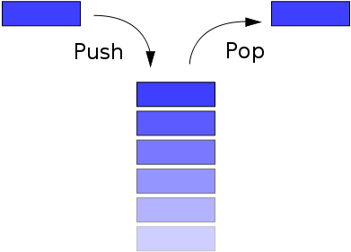

.. Author: Tower Joo<zhutao.iscas@gmail.com>
.. Time: 2009-06-18 15:15

========================================
container 容器
========================================

.. _container_detail:

文档概要
========================================

.. contents::
    :depth: 2
    

.. index::
   array

.. _array:

array  数组
========================================
定义
----------------------------------------

An **array** is a data structure consisting of a collection of *elements* (values or variables), 
each identified by one or more integer indices, stored so that the address of each element
can be computed from its index tuple by a simple mathematical formula.

**Array** is the computer analog of the mathematical concept of *vector*, *matrix*, and *tensor*.

**store**, **select** 需要常数时间, 向中间插入或者删除一个元素需要 **线性时间**.

实现
----------------------------------------

利用计算机本身的地址系统.

注意问题
----------------------------------------

数组的大小是确定的,通常不能插入新元素.元素类型必须是相同的(即占用的空间大小相同).

**Dynamic Array** 是一种大小可增长的数组, 通常是当当前的大小不够时,申请 **二倍** 于当前
大小的内存空间,而后将之前的数组内容 **拷贝** 到新的内存空间, 释放旧的内存空间.

.. index::
   map associative_array

.. _map:

map 映射
========================================
定义
----------------------------------------

An **associative array** (aka *associative container*, *map*, *mapping*, *hash*, *dictionary*, *finite map*) 
is an abstract data type composed of a collection of unique **keys** and a collection of **values**, 
where each key is associated with one value(or set of values).

**关联数组** 与数学中的 **有限域上的一个函数的概念** 很类似.

通常 **关联数组** 最重要的操作是 **索引,查找**

常用的操作
-------------

* Add
* Reassign
* Remove
* Lookup

实现
----------------------------------------

通常有两种方法来实现关联数组,分别为:

* hash table
* self-balancing binary search tree(例如, red-black tree or AVL tree)

另外, **skip lists** 也能用来实现关联数组(较少使用),还有 **B-tree** (通常当关联数组
很大,不能完全置于内存中)

注意问题
----------------------------------------

*hash* 实现的关联数组不保持有序,而 *binary search tree* 可以保持.
前者也不支持 **区间查询**,而后者 **支持**.

.. index::
   multimap

.. _multimap:

multimap 多重映射
========================================
定义
----------------------------------------

A **multimap** is a generalization of a :ref:`map` (associative array) in which
**more than one value** may be associated with and returned for a given key.

实现
----------------------------------------
通常 **多重映射** 通过 :ref:`list` 或者 :ref:`set` 作为关联数组 **值** 的 关联数组实现.

注意问题
----------------------------------------

C++ STL中提供有 **multimap** 的支持.

.. index::
   list

.. _list:

list 列表 
========================================
定义
----------------------------------------

A **list(sequence)** is an abstract data structure that implements an **ordered** collection of values,
where the same value may occur more than once.
It's a computer representation of the mathematical concept of a **finite sequence** 

如下图:

.. image:: ../image/Singly_linked_list.png

实现
----------------------------------------

通常 **list** 要么由 **linked lists** (单向或者双向列表),要么由 :ref:`array` (通常动态数组)来实现.

注意问题
----------------------------------------
由于 **list** 很容易实现,所以为简便起见,可以使用 **list** 来加入一些限制(如不允许重复,无序等)来实现
有限 **set**, 但是为了效率起见,通常会使用 **self-balancing search trees** or **hash table**.

.. index::
   queue

.. _queue:

queue 队列
========================================
定义
----------------------------------------

A **queue** is a particular kind of collection in which the entities in the collection 
are kept **in order** and the principal(or only) operation on the collection are 
the **addition of the entities** to the rear terminal position and **removal of entities**
from the front terminal position.

Queue is a **First-in-First-out(FIFO)** data structure.

在先进先出的结构中, 第一个加入队列的元素第一个被删除.

常用操作
--------

* bool empty()
* T& front()
* void dequeue()
* void enqueue()
* int size()

实现
----------------------------------------

通常可以使用 **circular buffers** (循环数组,复用) 或者 **linked list** 来实现队列.

注意问题
----------------------------------------

理念上,队列需要可以无限制的增加,但是是由于计算机的限制,实际中使用的通常是 **bounded queue**.

.. index::
   priority_queue

.. _priority_queue:

Priority Queue 优先级队列
========================================
定义
----------------------------------------

A **priority queue** is an abstract data type in computer programming that support the 
following **three** operations:

#. insertWithPriority: add an element to the :ref:`queue <queue>` with an associated priority
#. GetNext: remove the element from the queue that has the *highest priority*, and return it
   (aks **PopElement(Off)**, or **GetMinimum**)
#. PeekAtNext(optional): look at the element with *highest priority* without removing it

实现
----------------------------------------

通常可能使用 **heap** (例如, Fibonacci heap) 作为 *backbone*, 插入时O(1),删除时O(logn)

也可以使用 **self-backbone binary search tree** 来实现, 三种操作都是 O(logn)

注意问题
----------------------------------------

c++的STL中的 *priority_queue* (STL container adapter class template) 实现了一个 **max-priority-queue**.

python的 **heapq** module 实现了一个 **binary min-heap** (基于list).

.. index::
   set

.. _set:

set 集合
========================================
定义
----------------------------------------

A **set** is an abstract data structure that can store certain values,
**without any particular order** and **no repeated values**.

这是对于数学中的集合的一种计算机的实现.

常用的操作
-------------

* element_of(x, *S*) : check whether x is in the set S
* empty(S)
* size(S)
* enumerate(S) : yields the elements of S in some arbitrary order
* pick(S): return an arbitrary element of S
* build(x1, x2, .., xn): creates a set structure with values x1, x2, .., xn

还可能包括(动态集合):

* create(n)
* add(S, x)
* delete(S, x)
* capacity(S)

实现
----------------------------------------

通常使用 **self-balancing binary search tree** 或者 **hash table** 来实现.

注意问题
----------------------------------------

c++的STL提供有set标准类,使用的是 **binary search tree** 实现的有序集合.

.. index::
   multiset

.. _multiset:

mutliset 多重集合
========================================
定义
----------------------------------------

**mutliset** (aka, bag) which is the same as a set data structure, but
allows **repeated values**. 

通常, 一个多重集合可以看作一个将唯一的元素映射到表明元素的个数的正整数的关联数组.

multiset即支持有重复的元素(键).

实现
----------------------------------------
与 :ref:`set` 的实现方式相同.

注意问题
----------------------------------------

.. index::
   statck

.. _stack:

stack 堆栈
========================================
定义
----------------------------------------

A **stack** is an abstract data type and data structure based on the principle of
**Last-in-First-out(LIFO)**.

示意图如下:

一个栈是一个有序列表的元素.

元素以插入的相反顺序被移除.

实现
----------------------------------------

通常使用 :ref:`array <array>` 或者 *Linked list* 来实现栈.

注意问题
----------------------------------------

c++的STL实现了一个只支持 *push/pop* 操作的 **stack** 标准类.

参考资料
========================================

#. `Container <http://en.wikipedia.org/wiki/Container_(data_structure)>`_
#. `Double-Ended Queue <http://en.wikipedia.org/wiki/Deque>`_
#. `List <http://en.wikipedia.org/wiki/List_(computing)>`_
#. `Map <http://en.wikipedia.org/wiki/Associative_array>`_
#. `Multimap <http://en.wikipedia.org/wiki/Multimap>`_
#. `Multiset <http://en.wikipedia.org/wiki/Set_(computer_science)#Multiset>`_
#. `Priority_queue <http://en.wikipedia.org/wiki/Priority_queue>`_
#. `Priority <http://en.wikipedia.org/wiki/Queue_(data_structure)>`_
#. `Set <http://en.wikipedia.org/wiki/Set_(computer_science)>`_
#. `Stack <http://en.wikipedia.org/wiki/Stack_(data_structure)>`_
#. `String <http://en.wikipedia.org/wiki/String_(computer_science)>`_
#. `Tree <http://en.wikipedia.org/wiki/Tree_(computer_science)>`_

