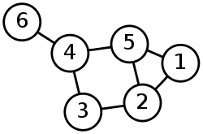

.. Author: Tower Joo<zhutao.iscas@gmail.com>
.. Time: 2009-06-25 10:38

.. index::
   search

========================================
搜索算法总结
========================================

文档概要
========================================

本部分主要分为如下几类:

#. 序列的搜索算法
#. 树相关的搜索算法
#. 图相关的搜索算法

.. contents::
   :depth: 2

序列的搜索算法
========================================

.. _binary_search:

.. index::
   binary_search

二分查找法
----------------------------------------

算法描述
++++++++++++

* 对于一个有序的序列
* 如果查找的元素比序列中间的元素大,则对后段进行相同的操作,否则对前段进行相同的操作
* 直至找到或者没有找到

实现
++++++++++++

实现一个 **没有错误的二分查找法很难**, 很多学者已经发现.

主要的实现困难包括:

#. 数值困难:由于int等类型的长度有限,所以在操作中可能会使得整形溢出,从而出现错误,例如应将 `mid=(low+high)/2` 转换为 `mid=low+(high-low)/2` 来避免溢出
#. 语法困难:对于类似于 `if-elseif-else` 这样的语法格式,即三路测试,它在实现层面需要 **平均1.5次比较** 而不是1次,所以效率方面会有问题.

递归的实现代码如下:

.. literalinclude:: ../code/search.c
   :language: c
   :linenos: 
   :lines: 4-20

非递归的实现代码如下:

.. literalinclude:: ../code/search.c
   :language: c
   :linenos: 
   :lines: 22-39

注意问题
++++++++++++

在求取mid时不能直接使用 **mid = (low+high)/2**, 因为可能引起整形溢出,
而这个问题直至20年后才发现.其它的类似加法(乘法)也有同样的问题.

复杂度
++++++++++++

平均和最坏情况下都是 O(log\ *n*).

对于 **无序序列** 可能要使用到 **线性查找**. 

树的搜索算法
========================================

.. _pre-order:

.. index::
   pre-order

先序遍历查找
----------------------------------------

算法描述
++++++++++++

* 先访问根结点,如果不等
* 查找左子树, 再查找右子树,直至找到所要查找的值
* 否则返回-1

实现
++++++++++++

此处实现的是二叉树的相关遍历算法如下:

**先序遍历递归**  的实现代码如下:

.. literalinclude:: ../code/search.c
   :language: c
   :linenos: 
   :lines: 105-113

**先序遍历非递归** 的实现代码如下:

.. literalinclude:: ../code/search.c
   :language: c
   :linenos: 
   :lines: 114-131

**中序遍历递归** 的实现代码如下:

.. literalinclude:: ../code/search.c
   :language: c
   :linenos: 
   :lines: 134-141

**中序遍历非递归** 的实现代码如下:

一个不好的算法(破坏了树的结构):

.. literalinclude:: ../code/search.c
   :language: c
   :linenos: 
   :lines: 142-173

一个好的算法(不改变树的结构):

.. literalinclude:: ../code/search.c
   :language: c
   :linenos: 
   :lines: 175-196

**后序遍历递归**  的实现代码如下:

.. literalinclude:: ../code/search.c
   :language: c
   :linenos: 
   :lines: 198-205

**后序遍历非递归** 的实现代码如下:

.. literalinclude:: ../code/search.c
   :language: c
   :linenos: 
   :lines: 207-237

**广度优先遍历非递归** 的实现代码如下:

.. literalinclude:: ../code/search.c
   :language: c
   :linenos: 
   :lines: 238-257

注意问题
++++++++++++

特别要掌握相关的非递归算法的实现过程.
要点:

#. 先序注意入栈和出栈的顺序
#. 中序合理的出栈
#. 后序注意要记住刚访问过的节点

对于树的查找,通常使用的是 **二叉搜索树** , 而不一般的树结构.

图的搜索算法
========================================

定义
----------------------------------------

上图为一无向图.

表示
-------
图(无向图和有向图)通常有两种表示方法,即

* 邻接表(对于稀疏图,即|E|<<|V|\ :sup:`2`)
* 邻接矩阵(对于稠密图,即|E|=|V|\ :sup:`2`, 很接近时)

通常我们使用 **邻接表** 来表示一个图,其数据结构如下:

.. literalinclude:: ../code/graph.c
   :language: c
   :linenos: 
   :lines: 238-257

    

----------------------------------------

注意问题
----------------------------------------

参考资料
========================================

#.
#.
#.
#.

