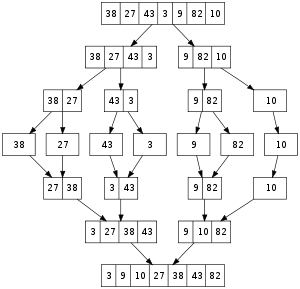
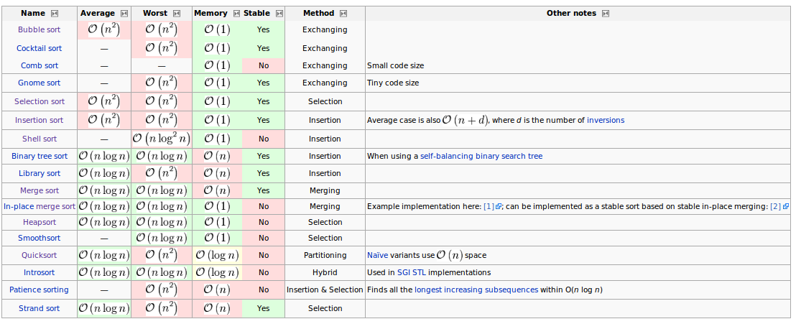
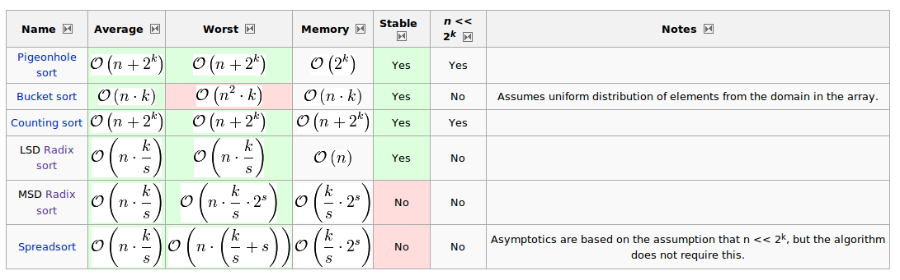

.. Author: Tower Joo<zhutao.iscas@gmail.com>
.. Time: 2009-06-24 14:11

.. _sort:

========================================
排序算法总结
========================================

文档概要
========================================
本部分主要对各种常见的排序算法进行相关的总结.

.. contents::
   :depth: 2

.. _bubble_sort:

.. index::
   bubble_sort

冒泡排序
========================================
定义
----------------------------------------
如果相邻的元素不符合顺序规则,则每次交换相邻的元素使得其符合,直至不需要交换,则认为已经是有序的了.

实现
----------------------------------------

.. literalinclude:: ../code/sort.c
   :language: c
   :linenos:
   :lines: 21-37

注意问题
----------------------------------------

时间复杂度:
最坏情况下和平均情况下的时间复杂度为O(n\ :sup:`2`)

由于性能的原因,所以在实际中 **冒泡排序** 是没有实际用处的,而很多专家甚至觉得这种算法没有任何意义.

在实际中, :ref:`冒泡排序 <bubble_sort>` 比 :ref:`插入排序 <insert_sort>` 的性能差了很多,
主要是因为 **冒泡排序** 大量的 **交换操作**, 而 **插入排序** 则少的多.

.. _select_sort:

.. index::
   select_sort

选择排序
========================================
定义
----------------------------------------

算法过程是:

1)找到序列中最小的元素
2)将其与第一个元素进行交换
3)对序列中剩余的元素实施相同的过程(从第二个元素开始,每次往前进一个位置)

实现
----------------------------------------

.. literalinclude:: ../code/sort.c
   :language: c
   :linenos:
   :lines: 38-53

注意问题
----------------------------------------
时间复杂度是:O(n\ :sup:`2`)

但是与 :ref:`插入排序 <insert_sort>` 还是显得慢了很多,但比 **冒泡排序** 要快.

因为 **选择排序** 只需要Big-thita(n)的交换的操作,而相应的 **插入排序** 需要n\ :sup:`2` 次交换,
所以在写操作比较 **expensive** 的应用中,使用 **选择排序** 比较合适.

实际中也可以采用 **双向** 查找方式,一次pass中找到 **最小** 和 **最大** 的,这样可以减少pass数

.. _insert_sort:

.. index::
   insert_sort

插入排序
========================================
定义
----------------------------------------

对于一个序列,插入排序是这样的思路,即待排序列之前的序列都是有序的,
那么对于新的元素,只需从有序的序列的右边开始比较,直至找到合适的位置,所以元素处理完即可

**插入排序** 的特点:

* simple implementation
* efficient for (quite) small data sets
* adaptive, i.e. efficient for data sets that are already substantially sorted: the time complexity is O(n + d), where d is the number of inversions
* more efficient in practice than most other simple quadratic (i.e. O(n\ :sup:`2`)) algorithms such as selection sort or bubble sort: the average running time is n\ :sup:`2`/4, and the running time is linear in the best case
* stable, i.e. does not change the relative order of elements with equal keys
* in-place, i.e. only requires a constant amount O(1) of additional memory space
* online, i.e. can sort a list as it receives it

实现
----------------------------------------

.. literalinclude:: ../code/sort.c
   :language: c
   :linenos:
   :lines: 54-74

注意问题
----------------------------------------
平均的时间复杂度是:O(n\ :sup:`2`),
对于已经有序的序列来说,时间复杂度为O(n),对于 **逆序** 的序列来说,时间复杂度为O(n\ :sup:`2`)

所以 **插入排序** 比较适合 **基本有序** 的序列.

但是与 :ref:`选择排序 <select_sort>` 相比,还是有较大的优势,因为 **插入排序** 尽可能地减少了 **scan的次数**, 通常
会是 **选择排序** scan次数的 **一半**.

.. _shell_sort:

.. index::
   shell_sort

希尔排序
========================================
定义
----------------------------------------
**希尔排序** 是 **插入排序** 的一种变体(或者一般化).

它通常是针对两个问题:

* 如果输入是 **基本有序**,则插入排序是高效的
* 因为 **每次只移动一个位置**, 插入排序是低效的

实现
----------------------------------------

.. literalinclude:: ../code/sort.c
   :language: c
   :linenos:
   :lines: 75-103

注意问题
----------------------------------------
通常 **gap序列** 使用如下的序列: {1,4,10,23,57,132,301,701,1750},比1750大的使用
nextgap = round(gap * 2.2)

.. _quick_sort:

.. index::
   quick_sort

快速排序
========================================
定义
----------------------------------------
**快速排序** 的算法过程如下:

* 从序列中选择一个元素作为 **pivot**
* 将小于 *pivot* 元素置于 *pivot* 之前,大于的置于之后
* 对 *pivot** 之前和之后的元素实施同样的过程,直至所以元素有序

实现
----------------------------------------

.. literalinclude:: ../code/sort.c
   :language: c
   :linenos:
   :lines: 104-127

注意问题
----------------------------------------
**快速排序** 是比较适合 **并行处理** 的,可以将各个子段来分配给不同的处理器来并行完成.

最坏情况下(已经有序)的时间复杂度为 O(n\ :sup:`2`), 平均和最好情况下为 O(nlog\ *n*).

.. _merge_sort:

.. index::
   merge_sort

合并排序
========================================
定义
----------------------------------------
**合并排序** 的算法过程如下:

* 如果一个序列长度为0或者1,则这个序列已经是有序的,否则
* 将未排序的序列分为 **基本等长** 的两个子序列
* 将子序列递归地使用 **合并排序**
* 将两个子序列合并到一个有序的序列中

示意图如下:

实现
----------------------------------------

.. literalinclude:: ../code/sort.c
   :language: c
   :linenos:
   :lines: 130-168

注意问题
----------------------------------------

最坏情况下, 平均和最好情况下的时间复杂度都是 O(nlog\ *n*).

与 :ref:`堆排序 <heap_sort>` 相比, **合并排序** 需要O(n)的空间,而 **堆排序** 
只需要O(1).

**合并排序** 比较适合 **大数据量** (比如数据很大,而不能一次性读入内存中), 也最适合 **链表排序**.

.. _heap_sort:

.. index::
    heap_sort

堆排序
========================================
定义
----------------------------------------
通常有两种类型的 **堆**, 即大顶堆和小顶堆,
其中, 大顶堆定义为:父结点总比子节点大(或者等于)的堆.(小顶堆则正好相反, 父结点总比子节点小(或者等于)的堆).

**堆排序** 的算法过程如下:

* 对已有的序列建立一个大顶堆
* 每次将根节点与最后一个叶子节点交换
* 对0, n-2 个元素重新调整,使其成为一个大顶堆
* 继续进行,直至所有元素有序

实现
----------------------------------------

.. literalinclude:: ../code/sort.c
   :language: c
   :linenos:
   :lines: 169-214

注意问题
----------------------------------------

最坏情况下, 平均和最好情况下的时间复杂度都是 O(nlog\ *n*).

.. _binary_tree_sort:

.. index::
   binary_tree_sort

二叉树排序
========================================
定义
----------------------------------------

二叉树排序是基于二叉搜索树来进行的一种排序算法.

**二叉树排序** 的算法过程如下:

* 对已有的序列建立一个二叉树
* 对二叉树进行中序遍历,得出的序列即为有序

实现
----------------------------------------

.. literalinclude:: ../code/sort.c
   :language: c
   :linenos:
   :lines: 224-295

注意问题
----------------------------------------

最坏情况下, 平均和最好情况下的时间复杂度都是 O(nlog\ *n*).

各种常用排序算法的比较
=========================

如下图:

所有的代码及测试程序
=====================

下载请点击 :download:`这里 <../code/sort.c>`

.. literalinclude:: ../code/sort.c
   :language: c
   :linenos:

参考资料
========================================

#. `Sorting_algorithm <http://en.wikipedia.org/wiki/Sorting_algorithm>`_
#. *Introduction to Algorithm*
