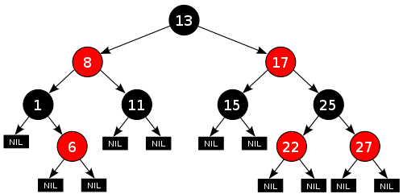

.. Author: Tower Joo<zhutao.iscas@gmail.com>
.. Time: 2009-06-21 10:30

========================================
红黑树
========================================

.. index::
	red_black

.. _red_black:

定义
========================================

满足下面特征的 :ref:`二叉搜索树<binary_search>` 属于 **红黑树** :

#. 每个节点要么红,要么黑
#. 根节点为黑
#. 每个叶子节点(NIL)为黑
#. 如果一个节点为红,则它的两个孩子节点都是黑
#. 对于每个节点, 从该节点到其后代叶子节点的所有路径包含着相同数目的黑色节点.

可用四句话总结为:

::

    节点红或黑,
    根叶都为黑
    父红子为黑
    路径黑同多

如所所示:

实现
========================================

具体代码
========================================

下载请点击 :download:`这里 <../../code/red_black.cpp>`

.. literalinclude:: ../../code/red_black.cpp
	:language: c++
	:linenos:

输出结果为:

::

应用
=======

在实际中可以用作如 :ref:`map` 的实现(关联数组), 也在函数式语言中有很重要的作用.

注意问题
========================================

参考资料
========================================

#. `Red-Black tree <http://en.wikipedia.org/wiki/Red-black_tree>`_
#. 算法导论 p273

