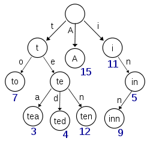

.. _tree:

==========================
trie树(前缀树)学习总结
==========================

.. highlight:: c

.. index::
   trie_tree

trie树（前缀树）
========================
.. note::

    在计算机科学中，一个trie，或者称作前缀树，是一种有序树的数据结构，用来存储键值通常为 **字符串的关联数组(Associative Array)**.
    在Trie树中，每个节点的后代都有共同的与节点相关联的字符串前缀，根节点与空字符串相关关联。值通常并非与每个节点相关联，而只是
    与叶子节点关联. 
    一个Trie通常可视为一个 **确定的有限状态机(Deterministic Finite Automation)**.

    
优缺点
-----------
.. note::

    * 查找键更快.查找长度为m的键在最坏情况下花费O(m)时间.而在最坏情况下,BST(平衡二叉树)要花费O(mlogn),
    * 当包含有大量的短字符串时,trie要求更少的空间.
    * Trie对于 **最长前缀匹配** 很有帮助
    * 有些情况下很难表达所有的键,如浮点数.

实现
-----------
.. note::

    当字符串为{a,z}上的单词时，一个节点最多有27孩子（外加一个终结符）。
    ::

        #define N 26
        typedef struct Trie
        {
            int isEnd; //判断是否是单词终结结点
            char *trans;    //其它的相关信息,如翻译等
            struct Trie *child[N];  //对应的孩子节点,每个字母对应一个节点
        }Trie;

实例
----------
    
.. note::

    一个完整的Trie的例子.
    ::

        #include <stdio.h>
        #include <string.h>
        #include <stdlib.h>
        #define N 26
        typedef struct node
        {
            struct node *child[N];
            char *trans;
            int isEnd;
        }node;
        
        // 建立Trie
        void createTrie(node *root)
        {
            int i;
            for(i=0; i<N; i++)
                root->child[i] = NULL;
            root->isEnd = 0;
            root->trans = NULL;
        }
        // add a word to the trie 
        void addElem(node *root, char *str, char *tran)
        {
            int len, i;
            char ch;
        
            node *newnode;
            node *p;
            p = root;
            len = strlen(str);
            for(i=0; i<len; i++)
            {
                ch = str[i];
                if (p->child[ch-'a'] != NULL)
                {
                    p = p->child[ch-'a'];
                    continue;
                }
                newnode = (node*)malloc(sizeof(node));
                createTrie(newnode);
                p->child[ch-'a'] = newnode;
                p =  newnode;
            }
            p->isEnd = 1;
            p->trans = tran;
        }

        // count the nodes under the node p
        int countEndNode(node *p)
        {
            int i, count;
            count = 0;
            if (p == NULL)
                return count;
            if (p->isEnd)
                count ++;
            for(i=0; i<N; i++)
            {
                count += countEndNode(p->child[i]);
        
            }
            return count;
        }

        // count the nodes start at the prefix
        int countPrefix(node *p, char *prefix)
        {
            int i, len;
            int count;
            node *q = p;
            char ch;
            len = strlen(prefix);
            count = 0;
            for(i=0;i<len; i++)
            {
                ch = prefix[i];
                if (q->child[ch-'a'] == NULL)
                    return 0;
                else
                {
                    q = q->child[ch-'a'];
                }
            }
            return countEndNode(q);
        }
       
        // tranverse the trie, pre-order tranverse
        void tranv(node *q)
        {
            int i;
            node *p;
            p = q;
            for(i = 0; i<N; i++)
            {
                if (p->child[i] == NULL)
                    continue;
                printf("%c ", 'a'+i);
                tranv(p->child[i]);
            }
        }
        
        // free all resource malloced, recursively
        void freeall(node *p)
        {
            int i;
            for(i=0; i<N; i++)
            {
                if(p->child[i] != NULL)
                {
                    freeall(p->child[i]);
                }
            }
            free(p);
        }
        // find the word str,
        // if found, then print the corresponding trans
        int findElem(node *q, char *str)
        {
            int i, len;
            char ch;
            node *p;
            p = q;
            len = strlen(str);
            for(i=0; i<len; i++)
            {
                ch = str[i];
                if (p->child[ch-'a'] != NULL)
                {
                    p = p->child[ch-'a'];
                    if (p->isEnd)
                    {
                        printf("\n%s has been found!", str);
                        printf("\nThe meaning of %s is %s!\n", str, p->trans);
                        return 1;
                    }
                }
                else
                    break;
            }
            printf("\n%s has not been found!", str);
            return 0;
        }

        // find the words which starts at prefix
        // not finished.
        void getPrefixWord(node *p, char *prefix, char **out)
        {
            int i, len, j;
            char ch;
            char *common;
            node *q;
            q = p;
            len = strlen(prefix);
            if (countPrefix(p, prefix) == 0)
            {
                out = NULL;
                return;
            }
            common = (char*)malloc(sizeof(char)*len);
        
            for(i=0; i<len; i++)
            {
                ch = prefix[i];
                q = q->child[ch-'a'];
                common[i] = ch;
            }
            j = 0;
            if (q->isEnd)
                out[j] = common;
        }
        
        // test main func
        int main()
        {
            node *p;
            char prefix[20];
            char age[] = "年令";
            char absent[] = "缺席";
            char normal[] = "正常";
            char TCN[] = "Train Communication Network";
            char keyword[20];
            p = (node*)malloc(sizeof(node));
            createTrie(p);
            addElem(p, "age", age);
            addElem(p, "absent", absent);
            addElem(p, "normal", normal);
            addElem(p, "tcn", TCN);
            printf("Enter a word to search its meaning:\n");
            scanf("%s", keyword);
            tranv(p);
            findElem(p, keyword);
            printf("\nEnter a prefix to search:\n");
            scanf("%s", prefix);
            printf("the prefix is %s\n", prefix);
            printf("The count of prefix '%s' is %d.\n", prefix, countPrefix(p, prefix));
            
            freeall(p);
            return 0;
        }

