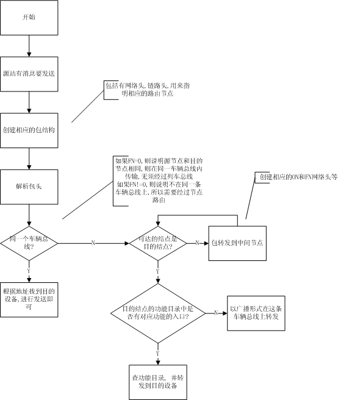
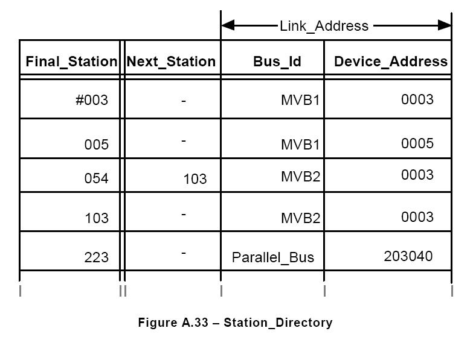
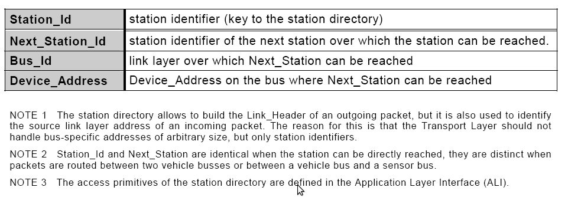
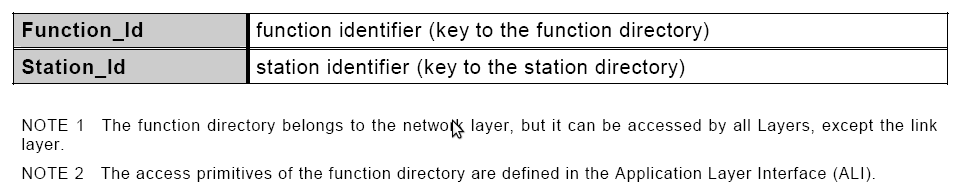
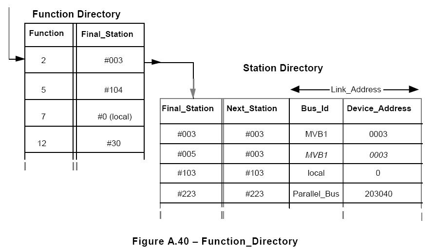
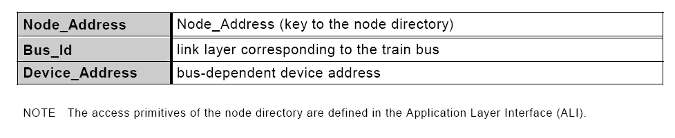
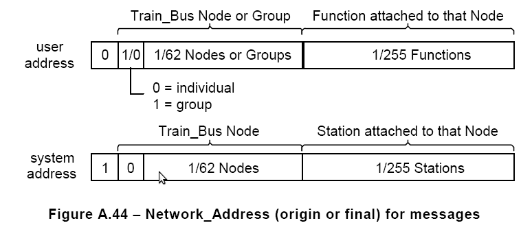
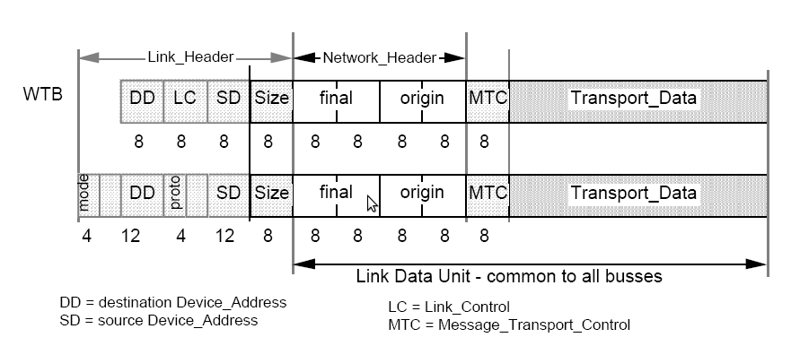
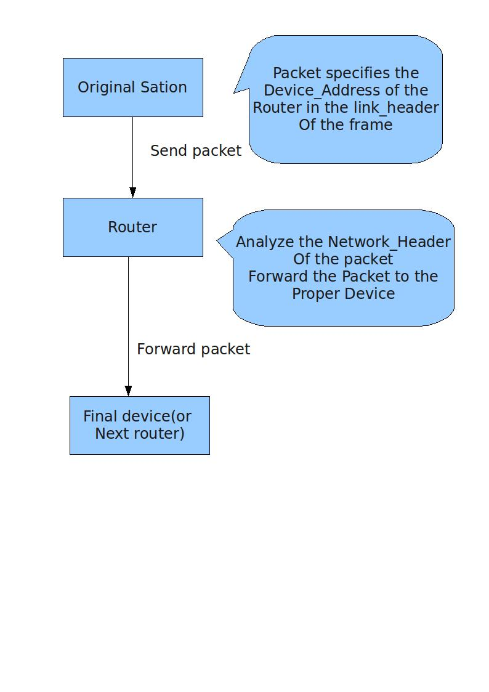
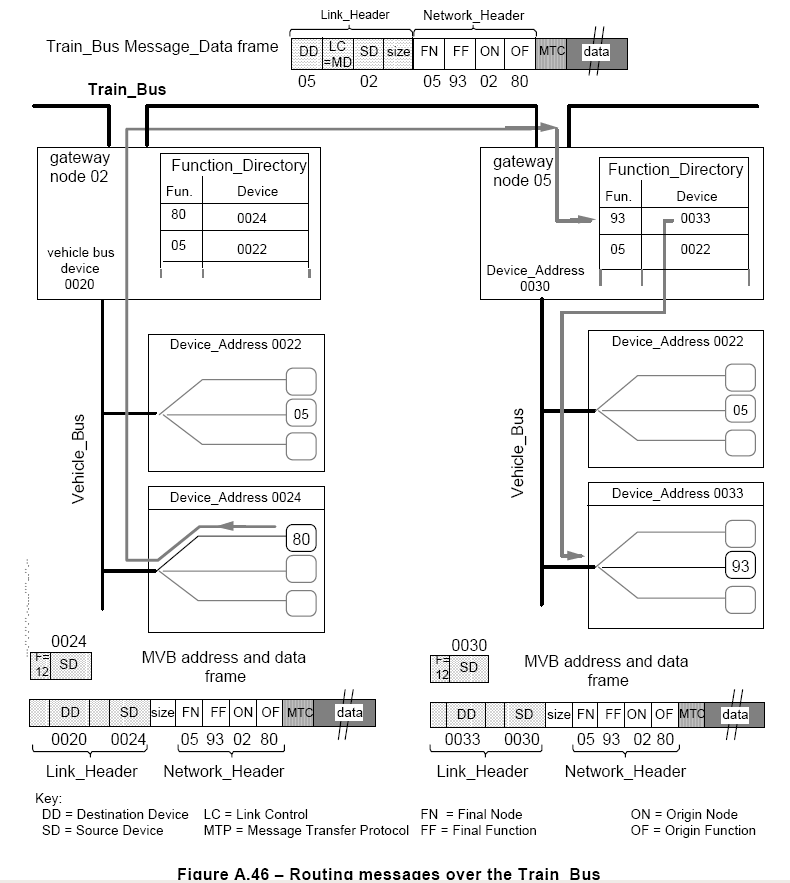

.. Author: Tower Joo<zhutao.iscas@gmail.com>
.. Time: 2009-06-15 10:01

========================================
RTP目录表总结
========================================

============= ==============   ===================   ====================  ===============
时间            版本号          更新内容                更新人              其它
============= ==============   ===================   ====================  ===============
2009-06-15     0.1             创建文档                朱涛                

============= ==============   ===================   ====================  ===============
    

文档概要
========================================

本文档主要是对RTP网络层涉及的四种目录表进行相关的总结.
四种目录分别为:

#. 站目录
#. 功能目录
#. 组目录
#. 节点目录

.. note::

    本文档所涉及的页码都是指 [IEC61375]_ 中的页码.

网络层的处理逻辑
================

如下图, 此图不包括出错处理(如拓扑计数器等)

站目录(Station Dirictory)
========================================

参见p510, p90.

**Manager** 通过 **Station_Identifier** 来访问设备, 而不是通过它们的
**Device_Address**. 所以在 **Station_Identifier** 和 设备的 **Link_Address** (Bus_Id 和 Device_Address)
之间存在着 **一对一** 的映射.

之间的映射关系如下:

通常使用 **Agent** 来负责管理 **Station_Directory** 

**Station_Directory** 中的静态入口是在 **配置时间** 来完成的.

.. note::

    Station_Identifier的生成方法:

    对于一个 **terminal station** ,只需要将 **Station_Identifier** 扩充4个打头的0即可得到 **Device_Address**

    例如, 8比特的 **Station_Identifier** `11111101B` 映射在MVB上的 **Device_Address** 为 `000011111101B`

具体的结构如下:

数据结构定义
-------------

在OPNET中使用结构体来定义 **站目录** 结构如下(具体的参数说明和返回值说明参见p164):

.. code-block:: c

   typdef struct
   {
       UNSIGNED8 station;  // key of the station direcotry, MUST be unique
       UNSIGNED8 next_station; // the next station's id which this station can be reached
       ENUM8 bus_id;  // the bus id over which Next_Station can be reached
       UNSIGNED64 device_adr; // device address on the bus where Next_Station can be reached
   }AM_STADI_ENTRY;

相应的处理函数包括(p164):

.. code-block:: c

   AM_RESULT am_stadi_write(const AM_STADI_ENTRY entries[], UNSIGNED8 nr_of_entries);
   AM_RESULT am_stadi_read(AM_STADI_ENTRY entries[], UNSIGNED8 nr_of_entries); 

功能目录(Function_Diretory)
========================================

每个站(即使不是路由器)都持有一个 **Function_Diretory**,用来指明本总线上哪个站实现哪个功能,而且
要看持有一个 **Station_Directory** (也可以使用隐式的映射来代替,实现方式不一定), 用来指明
哪个 **Device_Address** 属于哪个 **Station_Identifier**.

功能目录将 **功能ID** 映射到 **站ID**, 具体的结构如下:

对于每个注册的功能, **Function_Diretory** 指明哪个站执行哪个功能. 
本站中的 **Station_Identifier** 称为 **Final_Station**

**Final_Station** 然后由 **Station_Directory** 来确定出 **Next_Station**, **Bus_Id** 和 **Device_Address**

数据结构定义
-------------

在OPNET中使用结构体来定义 **功能目录** 结构如下(p165):

.. code-block:: c

   typedef struct
   {
       UNSIGNED8 function; // function identifier (key to the function direcotry)
       UNSIGNED8 station; // station identifier (key to the station direcotry)
   }AM_DIR_ENTRY;

相关的函数定义如下(p165):

.. code-block:: c

   AM_RESULT am_clear_dir(void); //initialises the function direcotry
   AM_RESULT am_insert_dir_entries(AM_DIR_ENTRY \*function_list, unsigned number_of_entries); 
   AM_RESULT am_remove_dir_entries(AM_DIR_ENTRY \*function_list, unsigned number_of_entries);
   AM_RESULT am_get_dir_entry(UNSIGNED8 function, UNSIGNED8 \*station);   

组目录(Group_Directory)
===========================

通常一个站只能属于一个特定的组.

参与在 **多播通信** 的站的网络层应该指明本站属于哪个 **组** ,这个过程即通过一个 **组目录**,其结构如下:

数据结构定义
-------------

在OPNET中使用结构体来定义 **组目录** 结构如下(p166):

.. code-block:: c

   typedef UNSIGNED8 AM_GROUP;

在OPNET仿真中可定义为如下结构体(**修改原因:这样可以使得组目录成为全局**):

.. code-block:: c

    typedef struct 
    {
        UNSIGNED8 station;  // station id
        UNSIGNED8 GROUP;    // group address
    }AM_GROUP;

相关的函数定义如下(p166):

.. code-block:: c

   AM_RESULT am_clear_groups(void); 
   AM_RESULT am_insert_member(AM_GROUP group); 
   AM_RESULT am_remove_member(AM_GROUP group); 
   AM_RESULT am_member(AM_GROUP group);    

节点目录(Node_Directory)
==========================

**列车总线** 上一个节点的网络层会将 **Node_Address** 映射为 **Device_Address**.

.. note::

   如果WTB作为车辆总线,则可以通过在6比特的 **Node_Address** 来扩充两位打头的0来产生8比特的WTB **Device_Address**.

   节点目录是 **只读** 的,因为其内容是在 **初运行** 时定义的.

在一个固定组成的列车,如果简单的映射不足以完成相关的功能,则可使用下面的结构来完成从 **Node_Address** 到 **Device_Address**
的映射:

数据结构定义
-------------

在OPNET中使用结构体来定义 **节点目录** 结构如下:

.. code-block:: c

   typedef struct
   {
       int node_addess; // Node_Address(key to the node directory)
       int bus_id;  // link layer corresponding to the train bus
       int device_address; //bus-dependent device address
   }AM_NODE;

.. note::

    标准中没有相关的说明

数据结构中的常数定义
=====================

参考p154.

其它的相关细节
================

网络地址
---------

可参考 :ref:`network_function`

TCN为消息使用一个全局的,分层的地址.有两种类型的 **Network_Address**, 都是16比特长.

* **User_Address** 用来标识功能,由7比特的 **Node_Address** 或者 **Group_Address** 及一个8比特
  的 **Function_Identifier** 组成
* **System_Address** 用来标识 **Network_Management** 的站, 由7比特的物理 **Node_Address** 和 
  8比特的 **Station_Identifier** 组成.

包含有 **网络地址** 的MVB, WTB帧结构如下:

多播定址
----------

**Caller** 可能会使用 **Group_Address** 来访问一组的节点.

**Group_Address** 包含在 **Final_Address** 中.

* 在 **列车总线** 上, 用于多播的 **Device_Address** 是 **广播** 地址. 每个节点的路由器决定
  自己的节点是否属于地址中的组,如果属于, 它会将包转发到含有 **final Function** 的站.
  如果没有选中的功能,路由器会向 **车辆总线** 上广播这个消息
* 在 **车辆总线** 上,如果这个包只是通过 **列车总线** 来广播,则 **Device_Address** 是网关.
  如果包是通过 **车辆总线** 来广播,则这个帧以广播形式发送

组由6比特的 **Group_Address** 来标识.

路由过程
---------

如下图所示:

其中,在路由器分析 **Network_Header** 时,

* 如果 **final Network_Address** 标明了一个 **Function_Identifier**, 则, 网关决定通过自己的哪
  条总线和哪个 **Device_Address** 来到达 **final Function**. 网关会持有一个 **Function_Dirctory**
* 如果 **final Network_Address** 标明了一个 **Station_Identifier**, 则, 网关会推算出 **Device_Address**.
  然后, 网关会通过在这个帧中指明设备的 **Link_Layer address** 来将消息转发到 **final device(或者next router)** .
  网关会持有 **Station_Directory**.

路由器并不会把所有收到的包都进行转发,一些可能是定址为自身的(例如,一个 **列车总线** 节点也支持一些功能)

如果节点检测到一个包属于一个错误的初运行,或者没有 **Topo_Counter**, 则它会发送一个包含有新的 **Topo_Counter** 的
**断开连接** 请求.

整个过程的例子如下图:

.. note::

    流程可以描述为:

    #. 如果只是MVB总线上的传输(即Final Function和Source Function位于同一条总线上),即无需经过路由节点
    #. 如果需要经过路由节点来进行路由,则:
        
        * 如果可到达的第一个目标路由器是Final Node,则从 **Function_Dirctory** 中得到对应的设备地址,进行转发即可
          如果,在 **Function_Dirctory** 没有发现对应的功能ID(即功能未注册),则以广播形式进行转发
        * 如果可到达的第一个目标路由器不是 **Final Node** (即只是一个中间路由器), 则生成新的可到达的下一个路由的包,进行转发,直至
          目标路由器到达

参考资料
========================================

.. [IEC61375] IEC61375-1-2007.pdf

