.. Author: Tower Joo<zhutao.iscas@gmail.com>
.. Time: 2009-06-08 10:33

========================================
RTP网络层开发文档
========================================

更新记录
=============

============= ==============   ===================   ====================  ===============
时间            版本号          更新内容                更新人              其它
============= ==============   ===================   ====================  ===============
2009-06-10     0.2             更新部分内容                朱涛                
2009-06-08     0.1             创建文档                朱涛                

============= ==============   ===================   ====================  ===============
    

文档概要
========================================

本部分主要是根据 **IEC61375-1-2007.pdf** 文档进行的相关总结和相关数据结构的整理.

主要包括如下内容:

.. contents:: 主要内容
    :depth: 2

.. _standard:

标准学习总结
========================================

.. _network_function:

网络层功能
-----------

如下图所示:

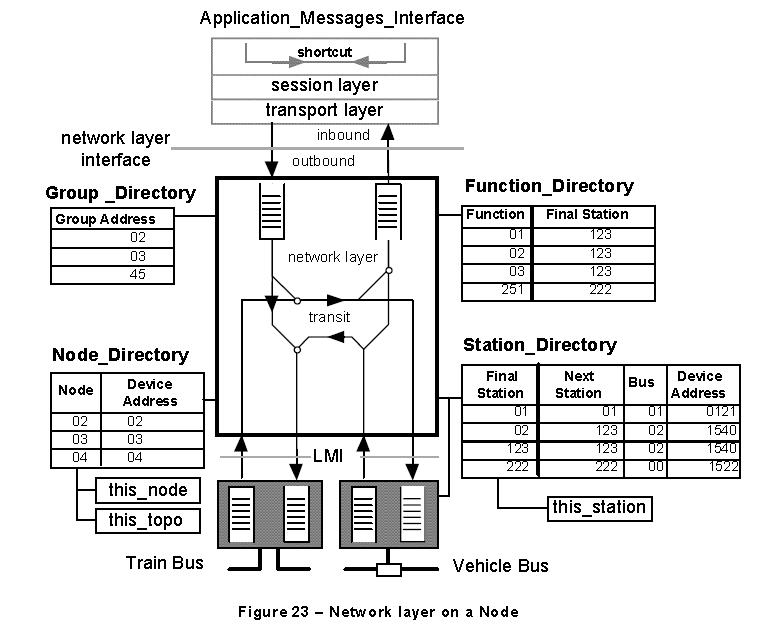

网络层转发包的功能包括:

* 从本站的 **传输层** 到 **链路层** 
* 从自己的 **一个链路层** 到 **传输层**
* 在一个路由节点, 从 **一个链路层** 到 **另一个链路层**

网络层把包从 **源站** 路由到 **终站**, 使用如下的四种目录:

* 站目录 : 站ID到站的链路地址的映射(及相反)
* 功能目录 : **Function_Id** 到 **Station_Id** 的映射(及相反)
* 组目录 : 在 **多播** 通信中,使用组目录来指明本站属于的组
* 节点目录 : 在 **列车总线** 上, 将 **Node_Address** 映射到 **Device_Address**

Packet Pool
------------

使用 **动态内存管理**, 初始时, *packet pool* 会创建为一些空包.

用户可以从包池中请求以及使用后归还包.

长期来看,包池中的包问题是平衡的.

**存在有多个包池, 典型的是每个链路层一对.一个包属于的池是它的 Owner**.

包结构如下:

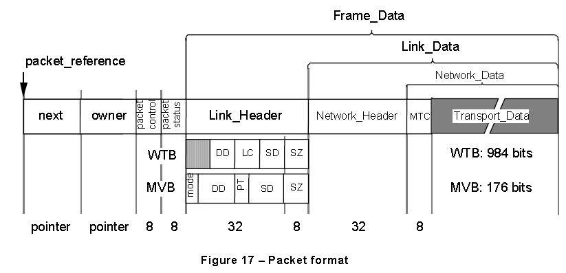

其中( **仿真实现中,不一定所有的域都得实现** ),

* next: 批向另一个包的指针
* **owner** : 标识包所属于的 **包池**, 用于处理一个使用过的包.

其它域可参考 p77.

网络层常量和变量的说明
----------------------

#. *Station_Id* 和 *Next_Station* 的可能取值包括:

    * **AM_SAME_STATION** 0(常量)
    * **AM_UNKNOW** 255(常量)
    * **this_station** 本站的8比特站标识符.如果一个站没有已申请的标识符,则 **this_station=AM_UNKNOW**
    * **final_station** 表明最终 *Network_Address* 的 **站**
    * **origin_station** 表明初始的 *Network_Address* 的 **站**
    * **next_station** 网络层发送一个包或者接收一个包时通过的 **站**

#. 节点的可能取值(都为 **UNSIGNED6** 类型):

    * **AM_SAME_NODE** 0(常数)
    * **this_node** 本节点的6比特的 *Node_Address*
    * **AM_ANY_TOPO** 0(常数) 任意的 *Topo_Counter* 值
    * **origin_node** 初始 *Network_Address* 的6比特 *Node_Address*
    * **final_node** 最终 *Network_Address* 的6比特 *Node_Address*
    * **this_topo** 本站的 *Topo_Counter* 值,由 *am_set_current_tc* 来注册
    * **my_topo** 本次会话应用来表明的 *Topo_Counter* 值.
    * **packet_topo** 由包承载的 *Topo_Counter* 值

#. 各种过程

    * **multicast** 如果 **组地址** 使用,则返回 **真**
    * **member(group)** 如果节点属于组,且多播使用,则返回 **真**
    * **fundi()**  返回由功能目录指示的 *Station_Id*
    * **stadi()** 返回由站目录指示的 *Link_Address*

网络层路由
--------------

9种路由情形:

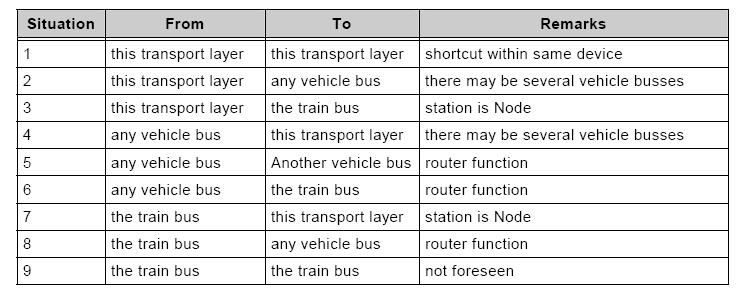

* 连接在 **车辆总线** 上的终端站点只可能遇到情形1,2,4
* 连接在 **列车总线** 上的终端站点只可能遇到情形1,3,7
* 连接在两条 **车辆总线** 上的路由站点只可能遇到情形1,2,4,5

网络路由功能
^^^^^^^^^^^^^

#. 返回路径检测

    * 网络层必须确保所有属于 **Call_Message** 和对应的 **Reply_Message** 的包使用相同的路由
    * 网络层会检测每个收到的包来确认是否能够向 **Origin_Address** 回送一个包,如果不能
      网络层 **不会进行转发包**

#. 拓扑一致性

    * 确保在一次消息传输过程中 **列车总线** 的配置发生变动, 从 **车辆总线** 上
      向一个节点发送或者从一个节点接收的包包含 **Topo_Counter**
    * 网络层持有在变量 *this_topo* 中存有一份最新的 **Topo_Counter**
    * 网络层会比较 *this_topo* 和收到的包中的称为 *packet_topo* 的值:

        * 当节点收到来自自身 **车辆总线** 的一个包:

            * **Origin_Address** 中的 *packet_topo* 等于 *this_topo* 或者 *AM_ANY_TOPO*, 节点
              会把自己的 **Origin_Address** 中的 *Node_Address* (this_node) 插入并且通过 **列车总线**
              转发这个包
            * 如果 **Origin_Address** 中的 *packet_topo* 与 *this_topo* 不等,也与 *AM_ANY_TOPO* 不等,
              节点会取消这次传输

        * 当节点收到来自 **列车总线** 另一个节点的一个包:

            * 指向自己一个站点或者一个功能的包, 将会把 **Final_Address** 中的 *this_topo* 作
              为 *packet_topo* 插入.
            * 最终站点会检测由节点发送的 *packet_topo* 与 *this_topo* 是否相同,不相同则
              最终站点会取消本次传输

#. 取消

    * 为了取消本次传输,网络层会将 **毁坏** 的包转发给 **传输层** , 向这个包的源发送一个原因为 *AM_INAUG_ERR*
      的 *Disconnect_Request* 包
    * 在初运行期间, 节点会向任何一个来自 **车辆总线** 和 **地址为另一条车辆总线** 的包响应一个
      原因为 *AM_INAUG_ERR* 的 *Disconnect_Request* 的包
    * 当一个设备接收到原因为 *AM_INAUG_ERR* 的 *Disconnect_Request* 的包, 它会取消所有的
      **列车总线** 上正在进行的连接.
    * 网络层是 **无连接的**, 所以它不会执行上面的协议,它会将其委托给传输层.

.. _route-algorithm:

路由算法
^^^^^^^^^^^

* 对于发出的包进行路由

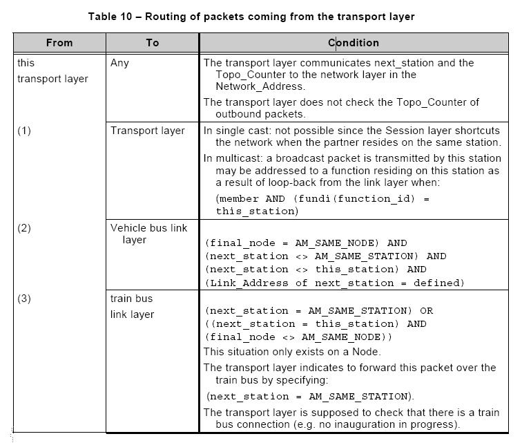

* 对于接收到来自 **车辆总线** 的包进行路由

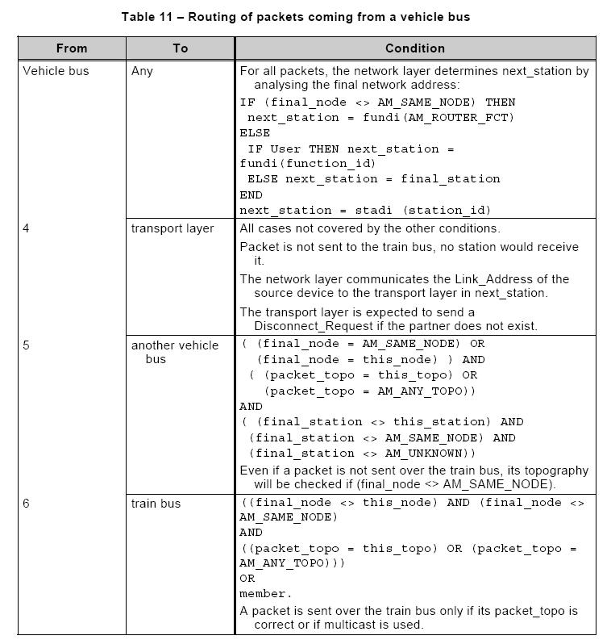

* 对于接收到来自 **列车总线** 的包进行路由

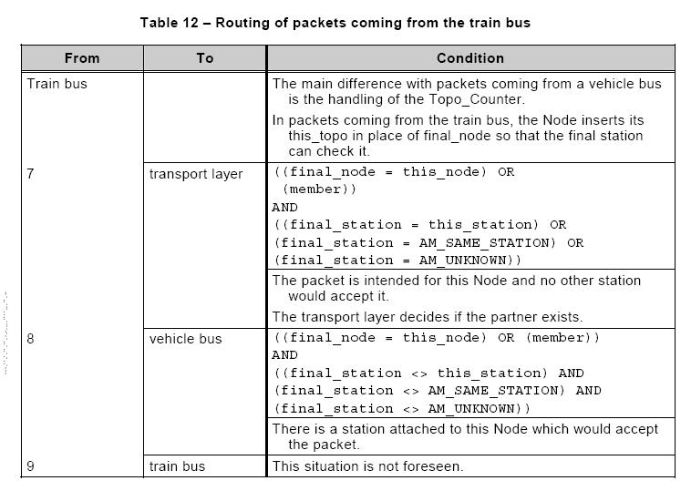

.. index::
    multicast

.. _multicast:

关于多播通信
----------------

参考p529.

多播通信允许 **多播信息** 发送到一组节点.

**多播通信** 通常用于 **旅客信息** 及一些 **通用命令**, 而这些信息通常会同时发送到不同的设备.

一个例子如下图:

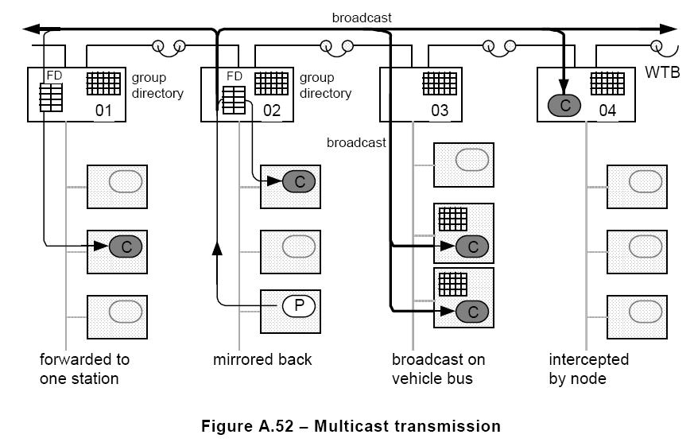

在列车总线上, 用于多播通信的 **Device_Address** 是 **广播地址**, 而每个节点的路由器来确定自己是否属于网络地址中的 **Group** (通过查 **组目录** ).
如果属于,则把包转发到持有 **Final Function** 的站.
如果没有可选择的功能(即无注册的功能入口),路由器则在 **车辆总线** 上进行广播这条消息.

车辆总线中只有实现了 **Group_Directory** 的站才能参与多播通信.

.. _rtp-structure:

数据结构总结
========================================

包结构总结
-----------

网络层的包结构如下:

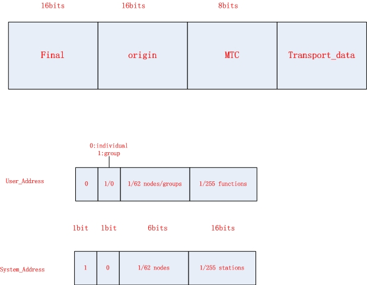

网络层包头编码
^^^^^^^^^^^^^^^

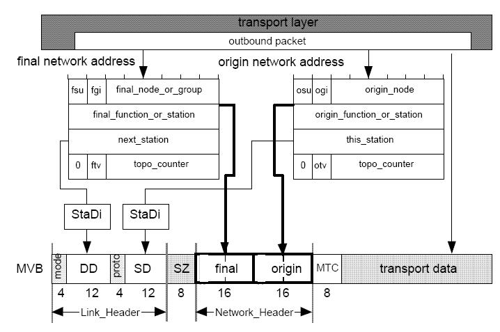

相关字段的含义如下:

#. fsu/osu(*Origin_Address* 中的osu会和 *Final_Address* 中的fsu具有相同的值)

    * 1: 是 **System_Address**, 则这个字节标识的是一个站
    * 0: 是 **User_Address**, 下一个字节标识一个功能

#. fgi/ogi(*Origin_Address* 和 *Final_Address* 中的 fgi和ogi具有相同的值)

    * 1: 一个组地址
    * 0: 单个地址

#. 6比特的 *orgin_node* 表示:

    * 初始节点的单一 **Node_Address**

#. 6比特的 *final_node_or_group* 表示:

    * 一个 *Group_Address* 如果 fgi 比标识的是一个组
    * 一个单一的 *Node_Address* ,其它情形

#. 一个 *Network_Address* 的第二个字节包括:

    * 一个站点标识符,如果 fsu/osu是 **System**
    * 一个功能标识符,如果fsu/osu是 **User**

#. *next_station*: 标识绑定发送或者接收通过的相同节点的站点(不必是初始站点或者最终站点)
#. 第四个字节包括 *Topo_Counter*,其中

    * 最高位的比特,frv/orv 是 0
    * 次高位的比特, ftv/otv 表明低六位包含一个合法的计数值(除了当组地址被使用)

MVB的网络地址编码
^^^^^^^^^^^^^^^^^^
如下图示:

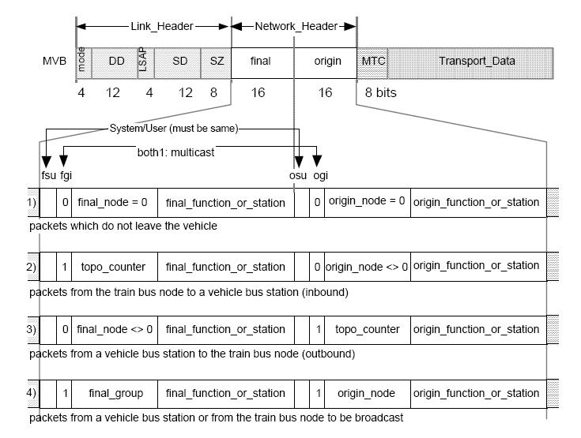

其中需要说明的是:

* 只在一个 **车辆总线** 内发送(final_node=origin_node=AM_SAME_NODE)的包不承载 *topo_counter* : fgi/ogi是0
* 由 **节点** 发送的包(orgin_node<>AM_SAME_NODE)承载 *topo_counter* 而不承载 *final_node* : fgi是1
* 发向 **节点** 的包(final_node<>AM_SAME_NODE)承载 *topo_counter* 而不承载 *orgin_node* : ogi是1
* 从一个 **车辆总线站点** 以多播形式向 **节点** 发送包或者相反, fgi/ogi都是1

如果从一个站点发送的包仅通过 **列车总线** 广播, 链路层的地址会是节点地址, *orgin_node* 会是 *AM_SAME_NODE* 

WTB的网络地址编码
^^^^^^^^^^^^^^^^^^^^^^^
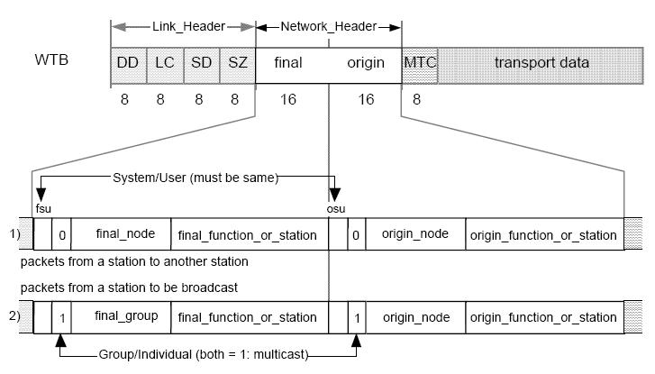

其中需要说明的是:

* *Orgin_Node* 和 *Final_Node* (或者Group) 会得到定义(<>AM_UNKNOW)
* *Final_Address* 和 *Origin_Address* 会使用相同类型的定址(system或者user), snu比特会置为相同的值
* *Origin_Address* 会是一个单一的 *Node_Address*
* 如果 final address 指明一个 **Group** (多播), fgi/ogi都会置为1

相关的数据结构
---------------

MVB网络头的数据结构
^^^^^^^^^^^^^^^^^^^^^^^

.. code-block:: c

    Network_Header::= RECORD
    {
    fsu ENUM1 -- final address (system or
    user)
    {
    USER (0) -- user address (function) is
    used
    SYSTEM (1) -- system address (station) is
    used
    },
    fgi UNSIGNED1, -- group, considered together
    with 'tpv'
    ONE_OF [fgi * 2 + ogi]
    {
    ['00'B] final_node UNSIGNED6 -- vehicle
    internal
    (node = 0)
    ['01'B] final_node UNSIGNED6 -- outgoing (sent
    to node)
    (node <> 0)
    ['10'B] final_topo UNSIGNED6, -- incoming:
    Topo_Counter of node (if <>
    0)
    ['11'B] final_group UNSIGNED6 -- group address
    for multicast.
    },
    ONE_OF [fsu] -- depending on system or user
    address
    {
    [USER] final_function, UNSIGNED8,
    [SYSTEM] final_station UNSIGNED8
    }
    osu ENUM1, -- same as 'fsu', reject
    otherwise.
    ogi UNSIGNED1, -- considered together with
    gni
    ONE_OF [fgi \*2 + ogi] -- same as above
    {
    ['00'B] origin_node UNSIGNED6, -- vehicle
    internal communication
    (node = 0)
    ['01'B] origin_topo UNSIGNED6 -- outgoing:
    Topo_Counter of station (if
    <>0)
    ['10'B] origin_node UNSIGNED6, -- incoming:
    origin node
    (if <>0)
    ['11'B] origin_topo UNSIGNED6, -- origin node
    for multicast
    },
    ONE_OF [fsu]
    {
    [USER] origin_function, UNSIGNED8,
    [SYSTEM] origin_station UNSIGNED8
    }
    }
    

WTB网络头的数据结构
^^^^^^^^^^^^^^^^^^^^^^^

.. code-block:: c

    Network_Header::= RECORD
    {
    fsu ENUM1
    {
    USER (0) -- user address (function) is
    used
    SYSTEM (1) -- system address (station) is
    used
    },
    fgi UNSIGNED1, -- 1 if Group, 0 if Individual
    ONE_OF [fgi]
    {
    [0] final_node UNSIGNED6,
    [1] final_group UNSIGNED6
    },
    ONE_OF [fsu]
    {
    [USER] final_function, UNSIGNED8,
    [SYSTEM] final_station UNSIGNED8
    }
    osu ENUM1, -- same as 'fsu', if
    different: reserved
    ogi UNSIGNED1, -- same as fgi ( 1 =
    multicast)
    origin_node UNSIGNED6, -- origin is always a single
    node
    ONE_OF [snu]
    {
    [USER] origin_function, UNSIGNED8, -- if this is a user address
    [SYSTEM] origin_station UNSIGNED8 -- if this is a system address
    }
    }
    
.. _dev-plan:

开发计划
=========

概述
--------

RTP网络层的开发最重要的是 **路由算法** 的实现,所以本部分主要会根据
网络层与上下层(链路层,传输层)的接口,路由协议,组包拆包等几个部分来进行
阐述,重点会在对路由算法的实现方面.

组包拆包
---------

#. 组包

    * 当网络层接收到来自上层(传输层)的包要向下层(链路层)发送时,会进行相应的 **组包**
    * 组包过程参考 :ref:`rtp-structure`

#. 拆包

    * 当网络层接收到来自下层(链路层)的包要向上层(传输层)发送时,会进行相应的 **拆包**
    * 拆包过程参考 :ref:`rtp-structure`

.. 来自下层(链路层)的包结构如下:

.. note::

    具体的实现过程.

    组包即向传输层的包加入一个网络层的包头即可,而拆包过程即把带有网络层包头的包去掉
    网络层的包头从而得到传输层包头.

    在OPNET中可建立不同的包格式,生成相应的包,填充相应的域数据即可.

网络层与上下层的接口
---------------------

RTP网络层处于RTP协议的位置如下:

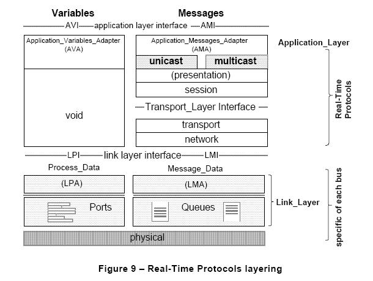

与下层(链接层)的接口LMI
^^^^^^^^^^^^^^^^^^^^^^^^

链路层为网络层提供了一定数量的服务(LMI: Link_Message_Data_Interface),来供网络层调用
完成特定的功能.

LMI原语可见 **IEC61375-1-2007.pdf** 中P83的相关说明.

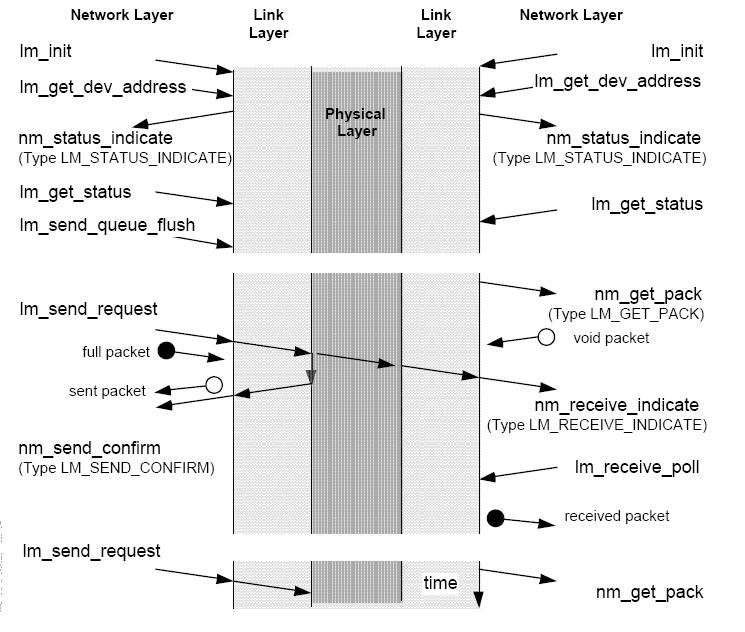

与上层(传输层)的接口
^^^^^^^^^^^^^^^^^^^^

.. note::

    The network layer interface to the transport layer is not specified and it is not open.
    The application may set up and consult the directories, which are conceptually part of the
    network layer, through the Application_Messages_Interface.(p103)

    根据标准中的说明,应用层可以通过AMI来对网络层进行相应的操作,所以部分的AMI应该属于网络层.

AMI原语参见 **IEC61375-1-2007.pdf** 中P154的相关说明.

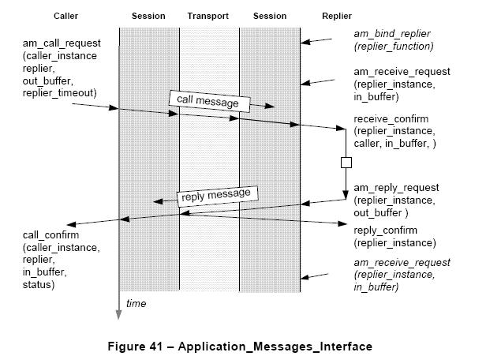

.. note::

    具体的实现过程.

    LMI是由链路层实现的,所以网络层无需关心,只需要调用相应的接口即可.

    AMI的部分原语应该是由网络层来实现的,具体哪些原语 **会进一步确认**, 会以函数的形式提供给
    应用层进行调用.

路由协议
----------

具体的路由算法可参见 :ref:`route-algorithm`

.. note::

    具体的实现过程.

    :ref:`route-algorithm` 中有详细的说明,根据相应的条件进行相应的函数实现即可.

    在实现中可能会遇到一些问题,在后期本文档中会逐步完善.

具体实现
----------------

RTP网络层OPNET仿真逻辑图如下:

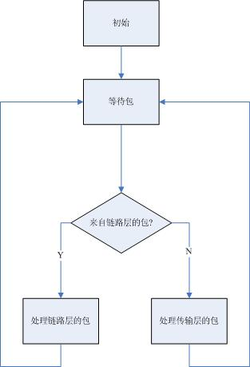

处理链路层的逻辑图如下:

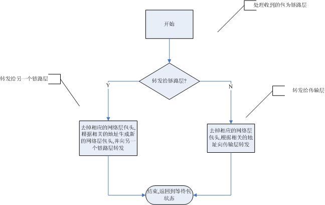

处理传输层的逻辑图如下:

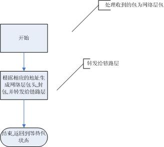

TODO
========

#. 确定AMI中哪些需要在网络层来实现
#. 在OPNET中定义相关的包结构
#. 在OPNET中实现基本的状态转移图
#. 在OPNET中实现路由算法
#. 测试
#. 集成

存在的问题
==============

#. 根据标准中的说法,AMI中的部分原语会由网络层提供,此部分还不是很明确
#. 当前的开发模式中,我要开发的网络层如何与上层和下层进行很好的交互,函数如何规范,包格式如何规范等

参考资料
========================================

#. *IEC61375-1-2007.pdf*

