==================================
RTP相关翻译(2.3.8-2.3.10)
==================================

.. note::

    本部分整理的为 *TCN-61375-1-2007* 中的2.3.8-2.4

2.3.8 消息会话层
=================

2.3.8.1 目的
-----------------

会话层将两个消息进行组对: **Call_Message** 和 **Reply_Message** .

**Call_Message** 由 *Caller* 发送给 *Replier*, **Reply_Message** 由 **Replier** 发送给 **Caller**.

这对消息允许实现如图39的 **远程过程调用(Remote Procedure Call)**.

图39如下

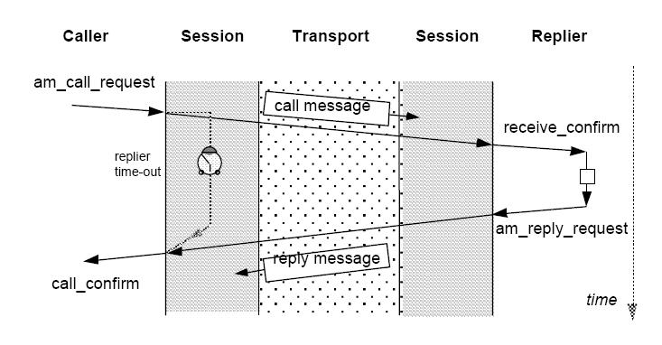

会话层对于每个消息的传送使用 **传输层** 进行服务.

2.3.8.2 会话标识符
-----------------------

会话层会 **唯一** 地使用一个 **会话ID(Conversation_Id)** 来标识通信的双方, 包括如下的 **级联(concatenation)** :

* 远程应用的 **网络地址(Network_Address)**
* 本地应用的 **功能Id(Fuction_Id)**

只要另一个有着相同 **Conversation_Id** 的会话正在进行,则会话层会 **拒绝** 对这个 **Conversation_Id** 的通信请求.

会话层会保持 *Caller* 完整的地址用来转发对应的 **Reply_Message**.

.. note::

    **Conversation_Id** 包含所有必需的用来将包转发到网络层的所有信息并且能够当这些包抵达时标识出这些包.

2.3.8.3 短路
-------------

当会话双方处于同一个 **站(station)** 时,会话层会将网络短路, 也就是说, 直接将消息转发而不通过 **传输层**.

2.3.8.4 拓扑计数器(Topo_Counter)检测
-------------------------------------

会话层会依据下面的算法对 *my_topo* (由应用提供)和 *this_topo* (网络层保持的 **拓扑计数器(Topo_Counter)** ) 进行一致性检测:

::

    IF (my_topo = AM_ANY_TOPO) THEN my_topo = this_topo ELSE
    IF (this_topo = AM_ANY_TOPO) THEN this_topo = my_topo ELSE
    IF (my_topo <> this_topo) THEN reject the call.

会话层会使用 **Topo_Counter** 的值来作为本次通话的时限(duration).

.. note::

    这点保证了:如果初运行发生在 *Call* 和 *Reply_Message* 之间,那么这次对话将被取消.

2.3.8.5 会话头编码
---------------------

在一个 *Call_Message* 的 *Connect_Request* 中,会话头由一个字节的填充0组成.所有其它的组成则像图40一样进行保留.

在一个 *Reply_Message* 的 *Connect_Request* 中,会话头由一个字节的包含由应答应用提供的应答状态组成.

图40如下:

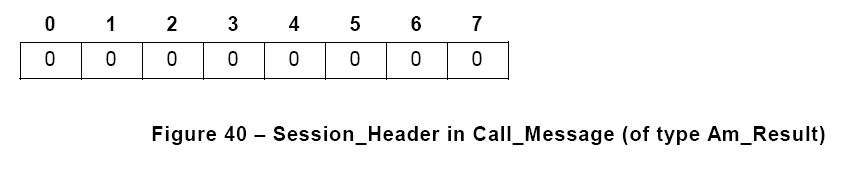

2.3.8.5 会话头编码
---------------------

在一个 *Call_Message* 的 *Connect_Request* 中,会话头由一个字节的填充0组成.所有其它的组成则像图40一样进行保留.

在一个 *Reply_Message* 的 *Connect_Request* 中,会话头由一个字节的包含由应答应用提供的应答状态组成.

图40如下:

2.3.8.5 会话头编码
---------------------

在一个 *Call_Message* 的 *Connect_Request* 中,会话头由一个字节的填充0组成.所有其它的组成则像图40一样进行保留.

在一个 *Reply_Message* 的 *Connect_Request* 中,会话头由一个字节的包含由应答应用提供的应答状态组成.

图40如下:

2.3.8.6 缓存管理
-----------------

会话层提供两种缓存管理:

#. 静态缓存,由应用申请和释放,及
#. 动态缓存,由 **会话(Session)** 申请和释放

2.3.8.7 会话层接口
------------------

会话层接口与应用层接口相同,因为表示层没有协议.

2.3.9 消息表示层
================

消息表示层 **没有** 协议.

消息会作为 **字的数组(Array of Word8)** 来进行传输,以升序的内存地址.

消息头和参数能够识别与 **过程变量** 相同的数据表示规则(例如,所有的数据会先传最高位的字节)

用于协议中的数据类型及对应用推荐的数据类型在2.4中列出.

2.3.10 消息应用层
===================

2.3.10.1 目的
---------------

**应用消息接口(Application_Message_Interface, AMI)** 允许应用通过网络来发送和接收消息. **AMI** 提供 **Call/Reply** 服务,以及 **初始化**, **缓存管理** 和 **多播服务**.

**AMI** 被定义为一组直接存取会话层的过程(表示层和应用层没有协议).

2.3.10.2 应用消息接口 Application_Message_Interface
------------------------------------------------------

2.3.10.2.1 AMI原语
^^^^^^^^^^^^^^^^^^^^^

**应用层接口** 要实现图41中的原语(列于表47及下面的各个子部分).

图41

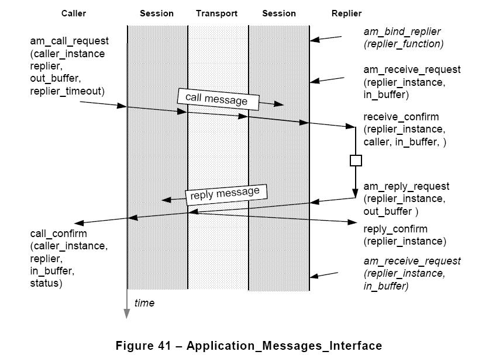

.. note::

    **AMI** 对象会添加 *am_* 或者 *AM_* (对应用消息而言)的前缀, 属于 *Caller* 或者 *rReplier* 实例的对象没有前缀.

.. note::

    下面的缩写用于名字:
        
        REM - 远程, 由参与通信的设备报告的错误
        LOC - 本地, 由自身设备报告的错误
        OVF - 溢出(overflow)
        TMO - 超时(time-out)

表47 AMI原语

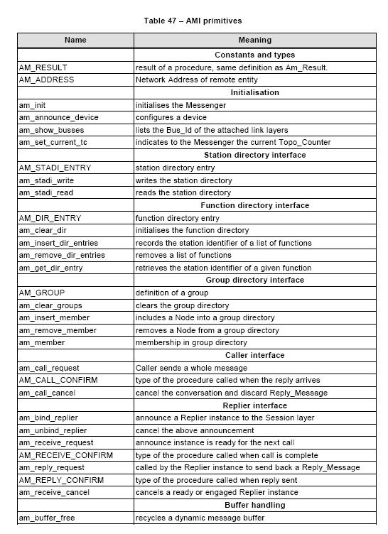

=========================  ====================================
名称                        含义
=========================  ====================================
                            **常数和类型**

AM_RESULT                   过程的结果,与Am_Result有相同的定义
AM_ADDRESS                  远程实体的网络地址

                            **初始化**

am_init                     初始化 *Messenger* 
am_annouce_device            配置设备
am_show_busses              列出关联链路层的 *Bus_Id* 
am_set_current_tc           向 *Messenger* 通知当前的 *Topo_Counter*

                            **站目录接口**

AM_STADI_ENTRY              站目录入口
am_stadi_write              写站目录
am_stadi_read               读站目录

                            **功能目录接口**

AM_DIR_ENTRY                功能目录入口
am_clear_dir                初始化功能目录
am_insert_dir_entries       记录一系列功能的站点标识符
am_remove_dir_entries       移除一系列的功能
am_get_dir_entry            获取给定功能的站点标识符

                            **组目录接口**

AM_GROUP                    组定义
am_clear_groups             清除组目录
am_insert_member            把一个节点包含在一个组目录中
am_remove_member            从一个组目录中移除一个节点
am_member                   组目录中的成员关系

                            **Caller接口**

am_call_request             Caller发送一个完整的消息
AM_CALL_CONFIRM             当应答到达时所要调用的过程类型
am_call_cancel              取消对话并且丢弃 Reply_Message

                            **Replier 接口**

am_bind_replier             向会话层报告一个应答者实例
am_unbind_replier           取消上述的报告
am_receive_request          为下一次调用报告实例已经准备好了
AM_RECEIVE_CONFIRM          当调用完成时所要调用的过程类型
am_reply_request            由应答者实例调用的发回一个 Reply_Message
AM_REPLY_CONFIRM            当应答完成时要调用的过程类型
am_receive_cancel           取消一个准备好的或者预订的应答者实例

                            **缓存处理**

am_buffer_free              收回一个动态消息缓存
=========================  ====================================

.. note::

    接口过程是 **非阻塞** , 任务调度没有限制.

2.3.10.2.2 AM_RESULT定义
^^^^^^^^^^^^^^^^^^^^^^^^^^^

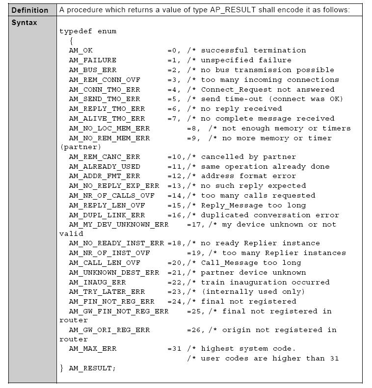

如果一个AMI过程返回一个应用依赖的用户码作为结果,这个结果应该 **大于** AM_MAX_ERR,并且 **小于** 256.

.. note::

    AM_RESULT与传送包中的Am_Result域相同的编码方式.

2.3.10.2.3 地址常数
^^^^^^^^^^^^^^^^^^^^

列于表48的常数为保留的标识符.

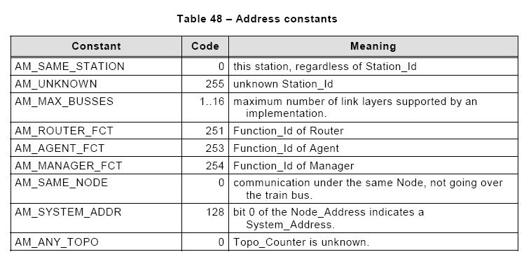

2.3.10.2.4 "AM_ADDRESS"类型
^^^^^^^^^^^^^^^^^^^^^^^^^^^^^

调用者或者应答者会通过通信另一方的应用地址来标识对方,而这个地址即是一种 AM_ADDRESS.

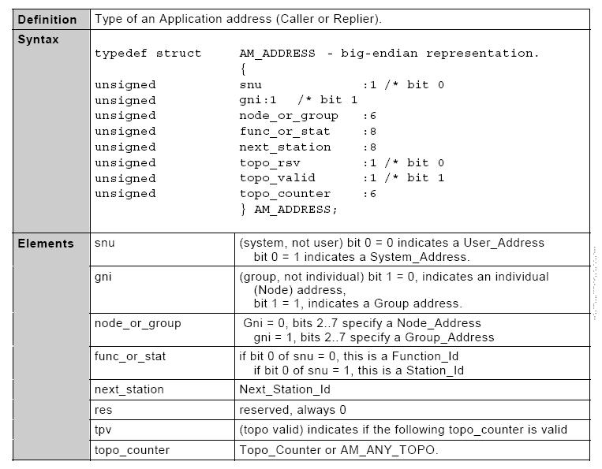

.. note::

    域的含义在调用者和响应者之间的含义是不同的,区别在下面的部分.

一个简便的应用地址编码由图42给出.

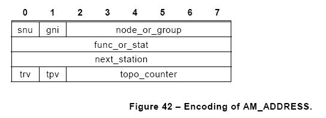

.. note::

    AM_ADDRESS是一种接口格式, Am_Address是一种传输格式

2.3.10.3 调用端
------------------
2.3.10.3.1 自己的标识
^^^^^^^^^^^^^^^^^^^^^^

调用者通过自己的 Function_Id 来标识自己.
 
.. note::

    调用者在 *am_call_request* 中标识自己.

2.3.10.3.2 调用者实例
^^^^^^^^^^^^^^^^^^^^^^^^^

因为调用者可以在收到应答前建立多个调用请求, 变量 *call_ref* 会将 *am_call_request* 和对应的 *am_confirm* 链接起来.

2.3.10.3.3 系统和用户(snu)
^^^^^^^^^^^^^^^^^^^^^^^^^^^^^^^

如果 **Manager** 以外的其它功能使用 *System_Address* 来发起一次调用, 这次调用 **不会** 执行,并且一个地址错误会以 *call_confirm* 的形式进行报告.

.. note::

    任意的功能可能会通过自己的 *User_Address* 来调用一个 *Agent Function* 或者一个 *Manager Function* ,并且指出 *next_station* ,但是只能发生在通信不通过列车总线来发送(node=AM_SAME_NODE).

2.310.3.4 组或者个体(gni)
^^^^^^^^^^^^^^^^^^^^^^^^^^^^

如果调用者设置 *gni* 为0,则单播协议会使用并且接下来的6位会作为 *Node_Address* 来进行解释.

如果调用者设置 *gni* 为1,则多播协议会使用并且下面的6位作为 *Group_Address* g来解释.

.. note::

    多播协议使用相同的地址格式.

2.3.10.3.5 节点或者组(node_or_group)

如果调用者指明 (Node_Address <> AM_SAME_NODE), 则这次调用被转发到列车总线节点.
 ,但是只能发生在通信不通过列车总线来发送(node=AM_SAME_NODE).

2.310.3.4 组或者个体(gni)
^^^^^^^^^^^^^^^^^^^^^^^^^^^^

如果调用者设置 *gni* 为0,则单播协议会使用并且接下来的6位会作为 *Node_Address* 来进行解释.

如果调用者设置 *gni* 为1,则多播协议会使用并且下面的6位作为 *Group_Address* g来解释.

.. note::

    多播协议使用相同的地址格式.

2.3.10.3.5 节点或者组(node_or_group)

如果调用者指明 (Node_Address <> AM_SAME_NODE), 则这次调用被转发到列车总线节点.
 ,但是只能发生在通信不通过列车总线来发送(node=AM_SAME_NODE).

2.310.3.4 组或者个体(gni)
^^^^^^^^^^^^^^^^^^^^^^^^^^^^

如果调用者设置 *gni* 为0,则单播协议会使用并且接下来的6位会作为 *Node_Address* 来进行解释.

如果调用者设置 *gni* 为1,则多播协议会使用并且下面的6位作为 *Group_Address* g来解释.

.. note::

    多播协议使用相同的地址格式.

2.3.10.3.5 节点或者组(node_or_group)

如果调用者指明 (Node_Address <> AM_SAME_NODE), 则这次调用被转发到列车总线节点.

.. note::

    即使应答者的 *Node_Address* 与调用者的 *Node_Address* 相同, 消息会被转发到节点,并且检测 *Topo_Counter* 并通过车辆总线将消息返回.

2.3.10.3.6 站或者功能(func_or_stat)
^^^^^^^^^^^^^^^^^^^^^^^^^^^^^^^^^^^^^

任意的 *Function_Id* 可能用于 *User_Address*

*Manager* 可能会在 *System_Address* 中指明 (Station_Id = AM_UNKNOWN),但是,如果 *next_station* 是 *AM_UNKNOWN* 的话,这次调用不会执行并且一个地址错误会以 *call_confirm* 的形式报告.

.. note::

    这就允许一个 *Manager* 在初始化时间里存取拥有一个未知 *Station_Id* 的站.

.. note::

    当一个调用通过列车总线来传输, Station_Id=0或者255来标识远程节点的地址,而不管它的 *Station_Id*

2.3.10.3.7 Next_Station 下一站
^^^^^^^^^^^^^^^^^^^^^^^^^^^^^^
*Next_Station* 标识消息将会被转发到下一个站的 *Link_Address* . *Next_Station* 也能指明最终的站或者路由站.如果由按照下面的计算:

#. 如果 *Next_Station* 指明 (Next_Station_Id <> AM_UNKNOWN), *Link_Address* 会从站目录中获得,使用 *Next_Station_Id* 作为入口.
#. 如果 *Next_Station* 没有被指明(Next_Station = AM_UNKNOWN), *Link_Address* 会从站目录中获得,使用下面的默认值作为入口:

    * 如果消息被发送到列车总线(Node_Address <> AM_SAME_NODE)或者(多播), *Next_Station_Id* 会从功能目录中获得,使用路由函数( *AM_ROUTER_FCT* )作为入口
    * 如果消息不是通过列车总线发送(Node_Address = AM_SAME_NODE):

        * 如果是 *System_Address* : *Next_Station_Id* 会被设置为与 *Station_Id* 相等
        * 如果是 *User_Address* : *Next_Station_Id* 会从功能目录中获取,使用 *Function_Id* 作为入口

    * 如果 ( Next_Station_Id = AM_SAME_STATION) 或者 (Next_Station_Id = this_station), *Messenger* 会把 *Call_Message* 转发给本地的应答者(如果存在)

如果站目录没有与 *Next_Station_Id* 对应的 *Link_Address* 入口, 一个地址错误会发生.

.. note::

    如果调用者位于一个节点, *next_station* 将会设置为 *AM_SAME_STATION*.

2.3.10.3.8 拓扑计数器 Topo_Counter
^^^^^^^^^^^^^^^^^^^^^^^^^^^^^^^^^^^^^

这个字节中的位0(最高位)会是0.

如果接下来的6比特包含一个合法的 *Topo_Counter*,则比特1会是1

否则,这个字节中所有的比特会是0(AM_ANY_TOPO).

如果应用对任意的东路(node<>AM_SAME_NODE)的调用指明的值为 *AM_ANY_TOPO* ,则一个地址错误会产生.

.. note::

    如果调用者忽略了拓扑结构,则这个调用者可能不会通过列车总线发送一个点对点的消息. 正常的流程是首先从节点或者中间应用中获得拓扑结构. 在固定的列车总线配置情况下, 任意数值的 *Topo_Counter* 都是可接受的.

2.3.10.3.9 调用者使用 Network_Address
^^^^^^^^^^^^^^^^^^^^^^^^^^^^^^^^^^^^^^^

*System_Address* 和 *User_Address* 模式总结如表49.

表49如下:

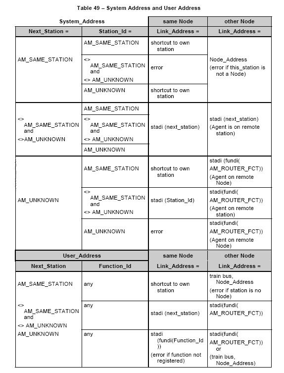

2.3.10.4 应答方
-----------------

2.3.10.4.1 应答实例
^^^^^^^^^^^^^^^^^^^^^^^

应答者进程是应用进程. 多个应答者实例可能会并行服务相同的功能. 调用者可能不会指明哪个实例来为本次调用服务.

在其功能可以调用 *am_receive_request* 过程来接收要到达的调用和调用 *am_reply_request* 过程来应答一个接收的调用, 每个应答者功能都应该有限制(bound).

在等待一个 *CAll_Message** 或者在一个 *Reply_Message* 的传输过程中, 应答者进程不会阻塞, 相反当一个 *Call_Message* 已经收到或者当 *Reply_Message* 的传输已经完成时, 应答者进程会得到通知.

要被调用用于通知的确认过程由绑定(binding)指明,并且因此与相同的应答者功能相同.

一个应答者实例会在它发出另一个 *am_receive_request* 之前, 应答或者取消每个收到的调用. 每个还没有得到确认的请求也可以被取消. 一个成功取消的请求不会得到确认.

2.3.10.4.2 应答者标识
^^^^^^^^^^^^^^^^^^^^^^^^

因为一个功能可以被多个实例执行, 变量 *replier_ref* 会将 *am_receive_request* 和对应的接收确认(receive_confirm),以及 *am_reply_request* 和应答确认(reply_confirm)链接起来,

一个应答者实例会由它的Function_Id和它的External_Reference来标识.

.. note::

    会话层会在等待 *Reply_Message* 的 *Call_Message* 中接收到应答者的完整地址并且保存起来.

2.3.10.4.3 系统或者用户(snu)
^^^^^^^^^^^^^^^^^^^^^^^^^^^^^^

如果消息是用 *System_Address* 来接收, *snu* 比特会置为1,并且在这种情况下, *Agent function* 会得以调用, 调用者会隐式地为 **Manager**.

如果消息是用 *User_Address* 来接收,则 *snu* 会置为0.

.. note::

    **Agent** 会被任意的其它功能通过 *User_Address* 来定址, 但是只有来自绑定有相同节点的站.

2.3.10.4.4 组或者单个(gni)

*gni* 比特会置为1则表明消息是通过多播地址来接收的,置为0则表明是通过单播地址来接收的.

.. note::

    这就允许通过单播或者多播无差别地调用应答者.

2.3.10.4.5 节点或者组
^^^^^^^^^^^^^^^^^^^^^^^^

无论单个或者一个 *Group_Address* 被使用, 接下的6个比特表明了调用者的 *Node_Address*, 或者如果调用者在它的调用者地址中指明了 *AM_SAME_NODE* 则为 *AM_SAME_NODE* .

.. note::
    
    如果调用者指明了 *Node_Address*, 那么即使消息不通过列车总线传输这个地址也会被发给应答者.

2.3.10.4.6 Next_Station 下一站
^^^^^^^^^^^^^^^^^^^^^^^^^^^^^^^^

*Next_Station* 是被接收的调用所使用的站的 *Station_Id* 或者如果终止站点是节点自己,则 *Next_Station* 会是 *AM_SAME_Stataion* .

2.3.10.4.7 拓扑计数器 Topo_Counter
^^^^^^^^^^^^^^^^^^^^^^^^^^^^^^^^^^^^^^

如果消息通过该节点转发, 应答者会接收到绑定在这个节点上的 *Topo_Counter* ,否则这个域会置为 *AM_ANY_TOPO*.

.. note::

    应答者负责检测 *Call_Message* 的 *Topo_Counter* 值与 *my_topo* 是否匹配.

2.3.10.5 初始化
-------------------

消息服务通过下面过程中不同层来进行初始化.

2.3.10.5.1 am_init 过程
^^^^^^^^^^^^^^^^^^^^^^^^^

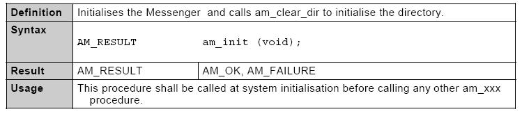

2.3.10.5.2 am_annouce_device 过程
^^^^^^^^^^^^^^^^^^^^^^^^^^^^^^^^^

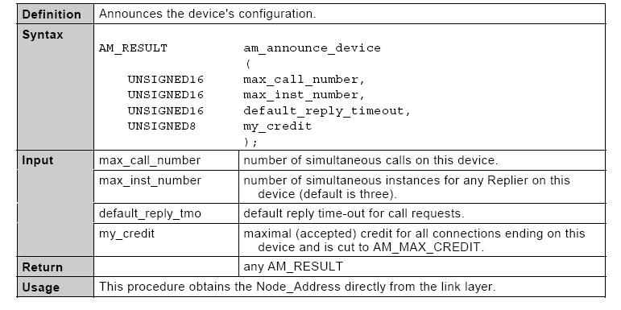

2.3.10.5.3 am_show_busses 过程
^^^^^^^^^^^^^^^^^^^^^^^^^^^^^^^^^

.. image:: ../image/am_show_busses.JPG

2.3.10.5.4 am_set_current_tc 过程
^^^^^^^^^^^^^^^^^^^^^^^^^^^^^^^^^^^^

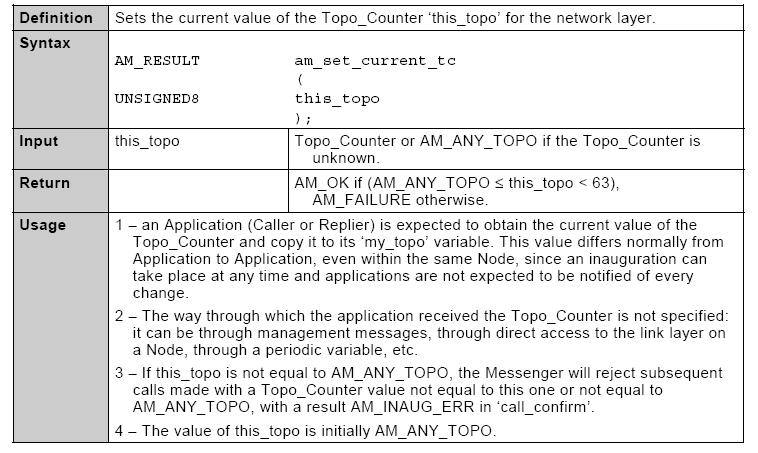

2.3.10.6 站目录接口
-------------------

站目录是可选的. 简单系统可以使用一个固定的方法来进行映射. 如果一个站目录得以使用,则通过下面的过程来使其可用.

2.3.10.6.1 AM_STADI_ENTRY 类型
^^^^^^^^^^^^^^^^^^^^^^^^^^^^^^

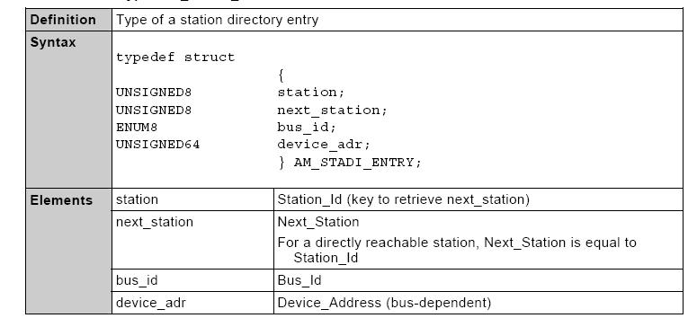

2.3.10.6.2 am_stadi_write 过程
^^^^^^^^^^^^^^^^^^^^^^^^^^^^^^

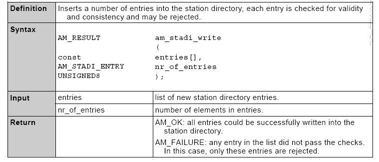

2.3.10.6.2 am_stadi_read 过程
^^^^^^^^^^^^^^^^^^^^^^^^^^^^^^

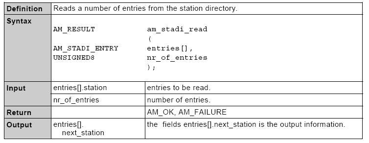

2.3.10.7 功能目录接口
----------------------

2.3.10.7.1 AM_DIR_ENTRY 类型
^^^^^^^^^^^^^^^^^^^^^^^^^^^^^^^

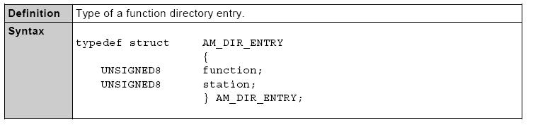

2.3.10.7.2 am_clear_dir 过程
^^^^^^^^^^^^^^^^^^^^^^^^^^^^^^^

.. image:: ../image/am_clear_dir.JPG

2.3.10.7.3 am_insert_dir_entries 过程
^^^^^^^^^^^^^^^^^^^^^^^^^^^^^^^^^^^^^^^^^^^

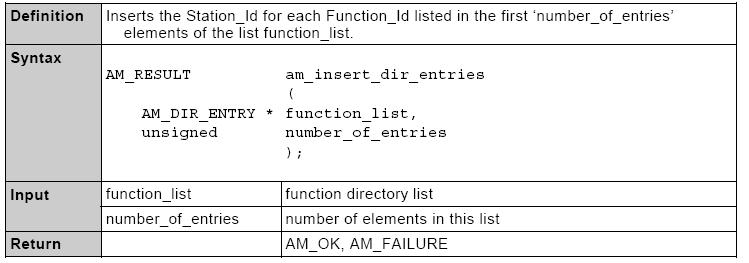

2.3.10.7.4 am_remove_dir_entries 过程
^^^^^^^^^^^^^^^^^^^^^^^^^^^^^^^^^^^^^^^^^^^

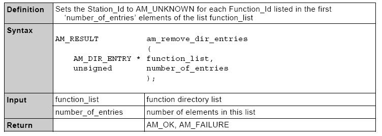

2.3.10.7.5 am_get_dir_entry 过程
^^^^^^^^^^^^^^^^^^^^^^^^^^^^^^^^^^^^^^^^^^^

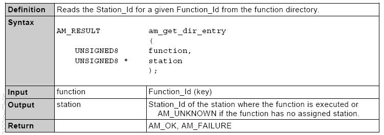

2.3.10.8 组目录接口
-------------------

2.3.10.8.1 AM_GROUP 类型
^^^^^^^^^^^^^^^^^^^^^^^^^^^

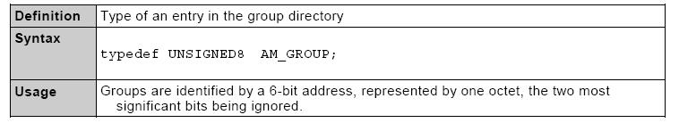

2.3.10.8.2 am_clear_groups 过程
^^^^^^^^^^^^^^^^^^^^^^^^^^^^^^^^^^^^

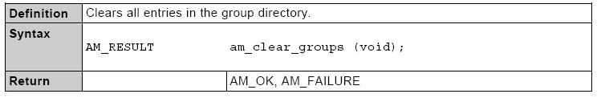

2.3.10.8.3 am_insert_member 过程
^^^^^^^^^^^^^^^^^^^^^^^^^^^^^^^^^^^^

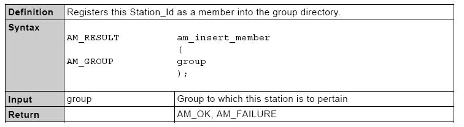

2.3.10.8.4 am_remove_member 过程
^^^^^^^^^^^^^^^^^^^^^^^^^^^^^^^^^^^^

.. image:: ../image/am_remove_member.JPG

2.3.10.8.5 am_member过程
^^^^^^^^^^^^^^^^^^^^^^^^^^^^^^^^^^^^

.. image:: ../image/am_member.JPG

2.3.10.9 调用者应用接口
--------------------------

2.3.10.9.1 am_call_request 过程
^^^^^^^^^^^^^^^^^^^^^^^^^^^^^^^^^^^

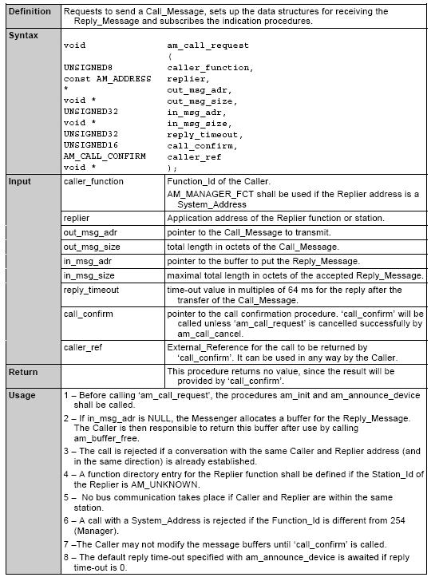

2.3.10.9.2 AM_CALL_CONFIRM 类型 
^^^^^^^^^^^^^^^^^^^^^^^^^^^^^^^^^^^

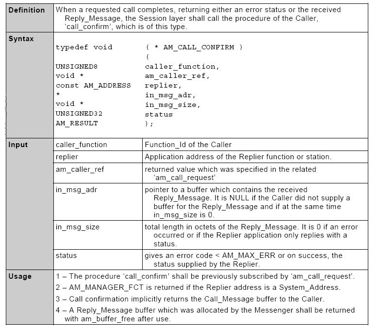

2.3.10.9.3 am_call_cancel 过程
^^^^^^^^^^^^^^^^^^^^^^^^^^^^^^^^^^^

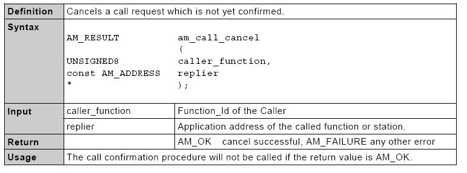

2.3.10.10 应答者应用接口
----------------------------

2.3.10.10.1 am_bind_replier 过程
^^^^^^^^^^^^^^^^^^^^^^^^^^^^^^^^^^^

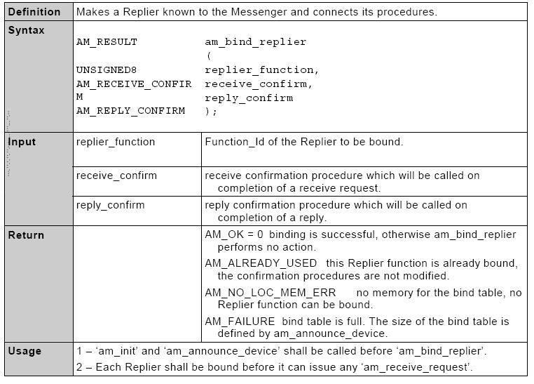

2.3.10.10.2 am_unbind_replier 过程
^^^^^^^^^^^^^^^^^^^^^^^^^^^^^^^^^^^

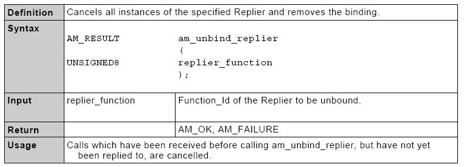

2.3.10.10.3 am_receive_request 过程
^^^^^^^^^^^^^^^^^^^^^^^^^^^^^^^^^^^

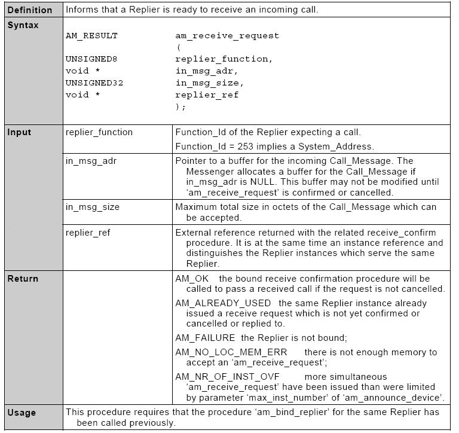

2.3.10.10.4 AM_RECEIVE_CONFIRM 类型
^^^^^^^^^^^^^^^^^^^^^^^^^^^^^^^^^^^

.. image:: ../image/am_receive_confirm.JPG

2.3.10.10.5 am_reply_request 过程
^^^^^^^^^^^^^^^^^^^^^^^^^^^^^^^^^^^

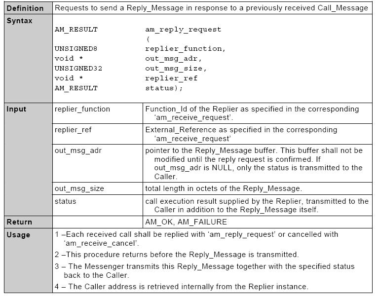

2.3.10.10.6 AM_REPLY_CONFIRM 类型
^^^^^^^^^^^^^^^^^^^^^^^^^^^^^^^^^^^

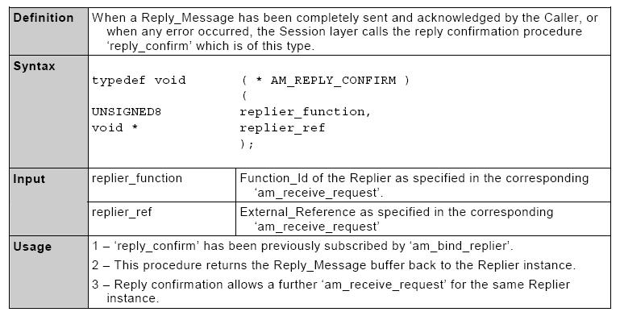

2.3.10.10.7 am_receive_cancel 过程
^^^^^^^^^^^^^^^^^^^^^^^^^^^^^^^^^^^

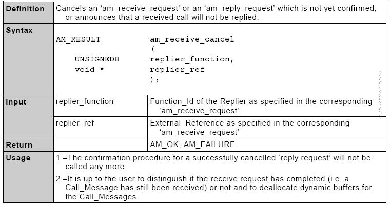

2.3.10.11 am_buffer_free 过程
---------------------------------

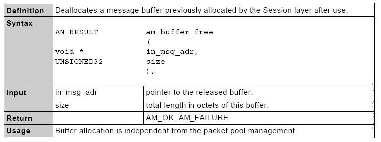

2.3.10.12 多播应用接口
---------------------------------

多播消息的应用接口与单播消息的应用接口相同.

不期待应答者会返回一个 *Reply_Message* ,但是期待调用 *am_reply_request* 来释放一个已经使用的动态的缓存. 但是在这种情况下,没有 *Reply_Message*  生成.

