===================================================
RTP协议翻译2.4部分(传输和存储数据的表示和编码)
===================================================

2.4.1 目的
============

这个子章节说明了数据类型并且定义了抽象的语法记号来表达用于传输和存储
这些数据类型和编码规则.
这些记号基于 *ASN.1(ISO/IEC 8824)* ,但是包含用于实时通信的其它结构.
相反,设备中的内部接口使用 **C** 语言进行描述,这些描述比较不严格.

2.4.2 数据定序(Data Ordering)
=================================

2.4.2.1 传输格式
------------------
这个标准规定了在列车通信网络上传输的比特和字的顺序.
为了达到这样的目的,标准定义了大量的原语和结构化类型.
数据的含义不在本标准的范围内.

2.4.2.2 Traffic_Store 格式
-----------------------------
标准推荐将数据以在总线上传输的相同格式来存储在 *Traffic_Store* 中, 并
将它们认为是一组的字节.

2.4.2.3 应用数据格式
--------------------
标准并没有说明应用数据格式.这个接口过程应该实现将应用数据格式转换为
用于存储和传输的数据格式,以及相反的转换.

2.4.2.4 通用的规则
--------------------

#. 数据结构应该从左到右,从上到下依据英语序进行标序.最上和最左的条目
   具有偏移量0
#. 内存被看作一组字节,并且不管传输单位(字节,32比特的字等)的大小,会按照
   地址增加的顺序进行传输.第一个字节具有字节偏移0
#. 一个数据结构中的字节会使用相对于结构体起始的偏移来标识.如果这个结构
   包含有一个无符号的整数,则最高位的整数会具有0偏移.
   这个比特在读数据类型时被认为是 **最左边** 的.
#. 所有数据都应该先传输高字节(*Big-Endian*)
#. 在一个字节里的比特传输顺序认为是由总线来决定,而程序员是不可见的.
   例如,WTB使用的HDLC协议首先会传输一个字节中最低位的比特(偏移为7)
   而MVB会最后传输最低位.
#. 数据类型信息不会与数据一起进行传输. 在一个特定的应用上, TCN的用户之间
   认为已经定义好数据类型并且相互认可.
#. 结构化数据类型(记录,序列)的元素会以它们声明时的顺序进行传输
#. 数组会按照索引增加的顺序进行传输. 多维数组会依据它们索引列出(例如, 数组
   ARRAY[row, culumn]会一行一行地传输)的顺序进行传输
#. 为了简化实现, 变量会存储在是其大小倍数的偏移地址里(对齐).
#. 变量大小数据(开放数组,记录,集合等)不会用于 **过程变量** ,但是可能会
   用于消息进行传输

2.4.2.5 与ASN.1的关系
---------------------
*ISO/IEC 8824* 定义了机器可读的表达数据结构的抽象语法记号(ASN.1).

虽然ASN.1没有强加一个传输语法,但是它不能表达经常在 **带宽** 或者 **时间** 
被程序员用于有限制的紧凑编码.
并且,它不能表达不遵守它的结构化方法的已经存在的编码.

因此,这个标准定义了一个基于ASN.1的抽象语法, 这个语法同时表达了数据编码
和数据的一位一位的内容.

下面的关键字已经加入到了ASN.1.

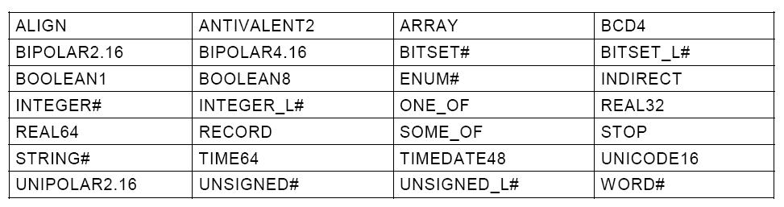

这个记号使用紧凑编码规则:

* 假定所有用户定义的类型可以由目标识别
* 使用固定大小的原语类型(在ASN.1中,整数可以任意大小)
* 包含需要的显式表达元素大小域
* 引入了自身的关键字来避免与ASN.1的混淆, 而语义是类似的,但是并不相同
  (例如 *ONE_OF* 代替 *CHOICE*, *SOME_OF* 代替 *SET* )
* 除了 *ONE_OF* 和 *SOME_OF* 外不使用隐式的类型标签, 而标签会作为一个特定
  域来显式说明
* 没有可选的域(除了 *SOME_OF* )
* 不用对齐, 即使对齐可以指明

使用下面对于记号的规则:

* 包括类型和常量标识符的关键字,都使用 **大写字母**
* 类型标识符由一个 **大写字母** 开始
* 域标识符使用一个 **小写字母** 开始

2.4.3 原语的记号
===================

2.4.3.1 布尔类型的记号
-----------------------

2.4.3.1.1 定义
^^^^^^^^^^^^^^^^
有两个不同值的原类型, TRUE 和 FALSE

.. note::

    这是ASN.1关于 **布尔类型** 的定义

.. note::

    这个类型用于表达二状态输入输出(中继, 二极管, 微开关等)

2.4.3.1.2 语法
^^^^^^^^^^^^^^^^^

BooleanType ::= BOOLEAN1

2.4.3.1.3 编码
^^^^^^^^^^^^^^^

一个布尔类型的变量会用一个比特来编码.

.. image:: ../image/bool-encoding.JPG

2.4.3.2 antivalent 类型记号
---------------------------
2.4.3.2.1 定义
^^^^^^^^^^^^^^^^^
一个有4个不同值的原类型.

.. note::

    这不是ASN.1类型

.. note::

    此类型的变量用于其它变量或者着急布尔类型的检测.

2.4.3.2.2 语法
^^^^^^^^^^^^^^

AntivalentType ::= ANTIVALENT2

2.4.3.2.3 编码
^^^^^^^^^^^^^^^^^^
一个antivalent类型的变量会作为2个比特来传输,第一位与布尔类型的
意义相同,第二位与它相反.

它可能会是4态之一,如下:

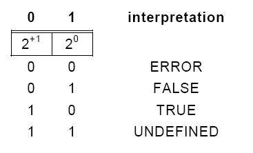

.. note::

    **ERROR** 和 **UNDEFINED** 状态可能会被应用作为合法状态来解释.

2.4.3.3 无符号整形记号
----------------------
2.4.3.3.1 定义
^^^^^^^^^^^^^^
一个不同值为正数的整个数字的原类型,包括0(作为单个值), 由后缀#定义的具有固定
大小的比特数.

.. note::

    这是一个限制固定大小#和非负数值的ASN.1 *IntergerType* ,

2.4.3.3.2 语法
^^^^^^^^^^^^^^^^
UnsignedType ::= UNSIGNED#, (# 为任意的无符号整数）

2.4.3.3.3 编码
^^^^^^^^^^^^^^^
一个无符号整数会按照二进制表达形式来传输,最高位先传.

如果数值( *carried value*) 比 *UNSIGNED#* 类型的大小小,则它会被
右平衡,并且扩展左侧为0

2.4.3.3.3.1 UNSIGNED8 编码
++++++++++++++++++++++++++++

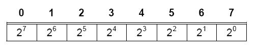

范围为:0..255

2.4.3.3.3.2 UNSIGNED16 编码
++++++++++++++++++++++++++++

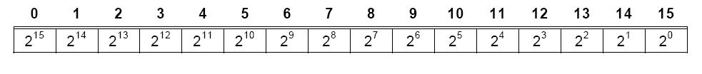

范围为:0..65535

2.4.3.3.3.2 UNSIGNED32 编码
++++++++++++++++++++++++++++

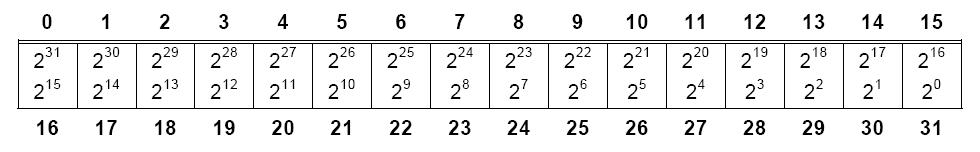

范围为:0..2^32-1

2.4.3.4 整形记号
--------------------
2.4.3.4.1 定义
^^^^^^^^^^^^^^^^
区别数值为正数或者负数的整个数字的原类型,包括0(作为一个单一数值),
具有由后缀#定义的固定大小的比特数.

.. note::

    这是一个限制了固定大小的ASN.1 *integer type* .

2.4.3.4.2 语法
^^^^^^^^^^^^^^^

IntegerType ::= INTEGER#, (# = 任意的无符号整数)

2.4.3.4.3 编码
^^^^^^^^^^^^^^^^

这个数值表示为2的补数, 第一传送的是符号位.

当传输的数值比 **INTEGER#** 类型的大小小时,会进行右平衡,
并且在左侧扩展符号位(如果是负数,使用'1',否则使用'0')

2.4.3.4.3.1 INTEGER8 编码
++++++++++++++++++++++++++++

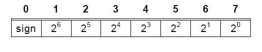

范围:-128..+127
例如, '1111 1110'B = -2

2.4.3.4.3.2 INTEGER8 编码
++++++++++++++++++++++++++++

.. image:: ../image/integer16.JPG

范围:-2^15..+2^15-1

2.4.3.4.3.3 INTEGER32 编码
++++++++++++++++++++++++++++

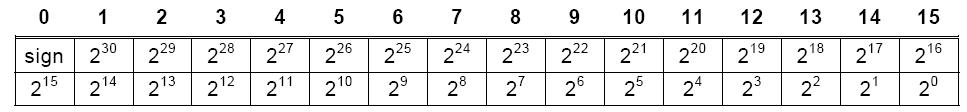

范围:-2^31..+2^31-1

2.4.3.5 枚举类型记号
--------------------------
2.4.3.5.1 定义
^^^^^^^^^^^^^^^^
给定唯一标识符作为类型记号一部分数值的原类型,由后缀#定义的固定大小比特数.

.. note::

    这是一个限制了固定大小#的ASN.1的 *ENUMERATED* 类型

2.4.3.5.2 语法
^^^^^^^^^^^^^^
EnumeratedType ::= ENUM#{Enumeration}

其中:

(# = 任意的无符号整数)

Enumeration ::= NamedNumber | Enumeration, NamedNumber

并且

NamedNumber ::= identifier (UnsignedNumber) | identifier (DefineValue)

数值可以以任意的顺序来列出.

例如:

.. code-block:: c

    Day_Of_Week_Type::= ENUM4
    {
        monday (1),
        tuesday (2),
        wednesday (3),
        thursday (4),
        friday (5),
        saturday (6),
        sunday (7),
        undefined (0)
    }

数值'2'指的是 '星期二'

2.4.3.5.3 编码
^^^^^^^^^^^^^^^^^^^

ENUM# 数值会用占用同样大小的无符号整形来表示.

2.4.3.5.3.1 ENUM4 编码
+++++++++++++++++++++++

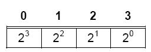

范围:0..15

例如 0001B 在上面的例子中指的是 **星期一**

2.4.3.5.3.2 ENUM8 编码
+++++++++++++++++++++++

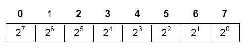

范围:0..255

例如 0000 0001B 在上面的例子中指的是 **星期一** (假设是ENUM8而不是ENUM4)

2.4.3.6 二进制编码的十进制类型记号
------------------------------------------
2.4.3.6.1 定义
^^^^^^^^^^^^^^^^
一个4比特的无符号整数表示一个0到9之间的十进制数.

.. note::

    这个类型在ASN.1中不存在.

2.4.3.6.2 语法
^^^^^^^^^^^^^^^^^
BinaryCodedDecimalType ::= BCD4

2.4.3.6.3 编码
^^^^^^^^^^^^^^
一个BCD4可以编码为使用相同大小的无符号整形.

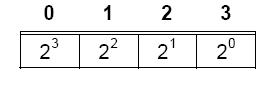

范围:0..9(其它数值无定义)

例子 '0111'B=7

.. note::

    一些无定义的数值可能会被使用,例如赋一个符号位或者其它的算术操作.

2.4.3.7 单极(unipolar)类型记号
---------------------------------
2.4.3.7.1 定义
^^^^^^^^^^^^^^^^
区别数值为非负数,整个数字被2的指数除的原类型,使用范围百分比来表达数值.

.. note::

    这些类型在ASN.1中不存在,在IEC870中表示为"无符号固定精度的浮点数"

2.4.3.7.2 语法
^^^^^^^^^^^^^^^^
UnipolarType ::= UNIPOLAR2.16

.. note::

    逗点前的数字给定2的指数来组成整数部分.

.. note::

    epsilon因子与字中最小的2的指数相等.

2.4.3.7.3 编码
^^^^^^^^^^^^^^^^^

单极类型的变量会以无符号整数的形式进行传输.

2.4.3.7.3.1 UNIPOLAR2.16 编码
++++++++++++++++++++++++++++++++

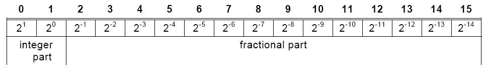

范围:0..400% - epsilon

2.4.3.8 双极(bipolar)类型记号
---------------------------------
2.4.3.8.1 定义
^^^^^^^^^^^^^^^^
区别数值为正数或者负数,整个数字(包括0)被2的指数除的原类型,使用范围百分比来表达数值.

.. note::

    这些类型在ASN.1中不存在,在IEC870中表示为"无符号固定精度的浮点数"

2.4.3.8.2 语法
^^^^^^^^^^^^^^^^
BipolarType ::= BIPOLAR2.16 | BIPOLAR4.16

.. note::

    逗点前的数字给定2的指数来组成整数部分.

.. note::

    epsilon因子与字中最小的2的指数相等.

2.4.3.8.3 编码
^^^^^^^^^^^^^^^^^

单极类型的变量会以无符号整数的形式进行传输.

2.4.3.8.3.1 BIPOLAR2.16 编码
+++++++++++++++++++++++++++++++++

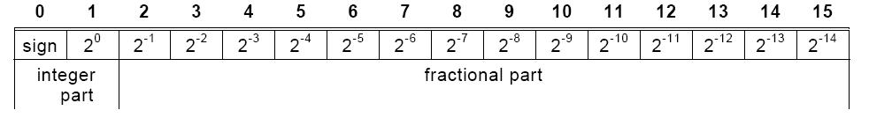

范围:-200%..+200% - epsilon

2.4.3.8.3.2 BIPOLAR4.16 编码
+++++++++++++++++++++++++++++++++

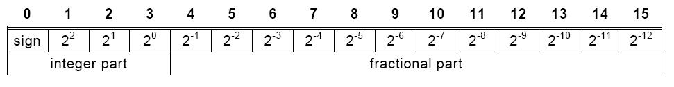

范围:-800%..+800% - epsilon

2.4.3.9 实型记号
-----------------
2.4.3.9.1 定义
^^^^^^^^^^^^^^^^
区别数值为实数集合成员的原类型.

2.4.3.9.2 语法
^^^^^^^^^^^^^^

RealType ::= REAL32

2.4.3.9.3 编码
^^^^^^^^^^^^^^^^
此类型会编码为IEEE754规定的短实数(32比特).

.. note::

    这是ASN.1限制为IEEE754短实数类型的 *RealType*

.. note::

    IEEE754规定的64比特的浮点数(REAL64)在此情景下不是很有用.

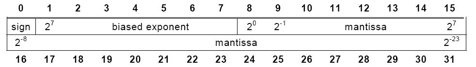

范围: +(-)3.37*10^38

2.4.3.10 字符类型记号
---------------------
2.4.3.10.1 定义
^^^^^^^^^^^^^^^^^^
区别值为定义在ISO/IEC8859-1字符集中成员的原类型.

2.4.3.10.2 语法
^^^^^^^^^^^^^^^^
CharacterType::=CHARACTER8

2.4.3.10.3 编码
^^^^^^^^^^^^^^^^
字符会按照无奇偶校验的一个字节来传输.

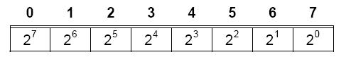

例如, '01100001'B=字符'a'(依据ISO/IEC8859-1)

2.4.3.11 Unicode字符类型记号
--------------------------------
2.4.3.11.1 定义
^^^^^^^^^^^^^^^^^^
区别值为定义在ISO/IEC10646字符集中成员的原类型.

2.4.3.11.2 语法
^^^^^^^^^^^^^^^^
UnicodeType::=UNICODE16

2.4.3.11.3 编码
^^^^^^^^^^^^^^^^
字符会按照无奇偶校验的一个字节来传输.

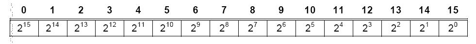

2.4.3.12 无责任(Uncommitted)类型记号
-----------------------------------------
2.4.3.12.1 定义
^^^^^^^^^^^^^^^^^^
无责任类型是由无定义的内容但是固定大小面组成.

2.4.3.12.2 语法
^^^^^^^^^^^^^^^^
AnyType::=WORD#, (#=任意的无符号整数)

2.4.3.12.3 编码
^^^^^^^^^^^^^^^^
无责任类型的变量没有规定的编码.

比特会根据类型为 **UNSIGNED#** 的变量的2的指数来命名, 而占用那个大小.

.. note::

    命名与相同字中的偏移方向相反的方向来命名.

2.4.3.12.3.1 WORD8 编码
++++++++++++++++++++++++++++

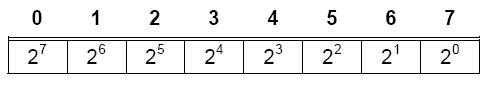

2.4.3.12.3.2 WORD16 编码
++++++++++++++++++++++++++++

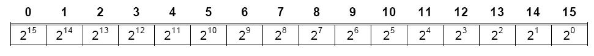

2.4.4 结构化类型
=================

2.4.4.1 常规
--------------

五种不同的结构化类型定义在此：

#. RECORD(变长）
#. ARRAY（定长或者变长）
#. BITSET#（定长）
#. ONE_OF（变长）
#. SOME_OF（变长）

2.4.4.2 记录类型记号
-----------------------

2.4.4.2.1 定义
^^^^^^^^^^^^^^^^
通过引用一个固定大小，有序的列表类型的结构化类型。新类型的每个值都是
一个有序列表的值，每个值来自组件类型。

.. note::

   此类型是ASN.1类型中无选择类型的 **Sequence Type**

.. note::

   当定义一个 **RECORD** 时推荐检察对齐，也就是说所有元素应该位于与记录开始
   的大小的倍数的偏移位置。

2.4.4.2.2 语法
^^^^^^^^^^^^^^^^

RecordType ::= RECORD{ElementTypeList}

并且

ElementTypeList ::= ElementType | ElementTypeList, ElementType

及

ElementType ::= identifier Type | Type

一个 **RECORD** 的元素应该由 **RECORD** 域紧接着一个点和子域标识符来标识，
当然可能其本身也是一个结构化的类型。

例如： **file.date.day**

2.4.4.2.3 编码
^^^^^^^^^^^^^^^^
**RECORD** 的元素会以它们声明的顺序来进行传输。

例如： *Date32* 类型的值可以表达如下：

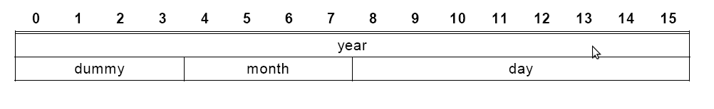

.. code-block:: c++

   Date32::= RECORD
   {
       year INTEGER16,
       dummy WORD4,
       month UNSIGNED4,
       day UNSIGNED8
   }

*dummy* 引入用来在一个16比特的界限的变量 *day* 的对齐。

2.4.4.3 bitset类型记号
-----------------------

2.4.4.2.1 定义
^^^^^^^^^^^^^^^^
*BOOLEAN1* 类型的一个数组[#]，并且具有后缀#定义的固定大小。

.. note::

   此类型与ASN.1中的 **BITSTRING** 对应。

2.4.4.2.2 语法
^^^^^^^^^^^^^^^^
BitsetType ::= BITSET# {NameBitList}

并且

NameBitList ::= NamedBit | NameBitList, NamedBit

及

NamedBit ::= identifier (number) | identifier (DefinedValue)

#. 每个出现在 *NamedBitList* 中的 *number* 或者 *DefinedValue* 值都应该不同，并且在一个 *bitset*
   值有一个区分比特来作为偏移
#. 出现在 **NamedBitList** 中的 *identifier* 应该各不相同
#. 所有的元素都隐式地具有 *BOOLEAN1* 类型。 *DefinedValue* 只能具有 *TRUE(1)* 或者 *FALSE(0)* 取值
#. 为了增加偏移，所有元素都应该得以声明
#. 如果 *BITSET* 的所有元素有声明， 则 *number* 可以忽略。 这是正常的情况

2.4.4.2.3 编码
^^^^^^^^^^^^^^^^
一个 *bitset* 的所有元素会按照声明的顺序进行传输。

.. note::

   *bitset* 元素的名称与它们的偏移可能不同。在汇编语言编程， 位移为0的比特通常在一个8位的机子里
   被命名为 *B7* 或者 *B15* 在一个16位的机子

2.4.4.3.3.1 BITSET8编码
++++++++++++++++++++++++++

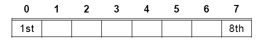

例如：

.. code-block:: c++

   AccessType8::= BITSET8
   {
       system (0), -- first bit of the bitset (MSB)
       owner (1),
       group (2),
       world (3),
   }
   is equivalent to
   AccessType8::= BITSET8
   {
       system, -- first bit of the bitset (MSB)
       owner,
       group,
       world,
       reserved4
       reserved5
       reserved6
       reserved7 -- 8th or last bit of the bitset (LSB)
   }

一个 **UNSIGNED8** 使用一个值为 *80H* 来占用那块空间，意味着 *system* 是集合中唯一的成员。

2.4.4.3.3.2 BITSET16编码
++++++++++++++++++++++++++++

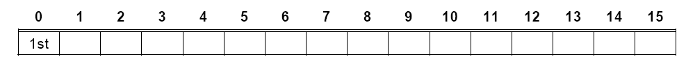

例如：

AccessType::= BITSET16 { system (0), owner (1), group (2), world (3)}

'0110 0000 0000 0000'B意味着 *owner* 和 *group* 是集合的成员。

2.4.4.3.3.3 BITSET32编码
++++++++++++++++++++++++++++

.. image:: ../image/bitset32.png

2.4.4.3.3.4 BITSET64编码
++++++++++++++++++++++++++++

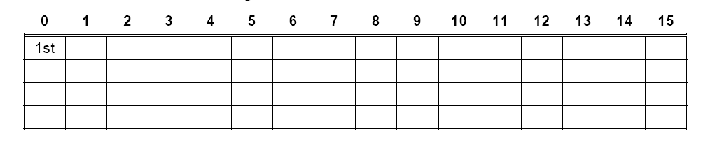

2.4.4.4 数组类型记号
-----------------------

2.4.4.2.1 定义
^^^^^^^^^^^^^^^^
引用单一的存在类型的结构化类型。新类型的每个值是一个有序的列表，包括0或者1个或者更多的已有类型的值。
每个值的位置由它的索引来标识。
值的个数由常数或者嵌入其中的结构的域来表明。
当一个 *stop* 元素存在时，值的个数可以忽略

.. note::

   一个 **ARRAY** 是ASN.1中由常数或者规定的变量或者不指定(stop元素）的元素个数的 **SequenceOf Type**

2.4.4.4.2 语法
^^^^^^^^^^^^^^^^

::

    ArrayType ::= ARRAY [IndexList] OF Type
    IndexList::= Index | IndexList, Index
    Index::=
        number | DefinedValue |
        identifier |
        identifier UnsignedType |
        UnsignedType |
        STOP = Value

*number*, *DefinedValue* 或者 *identifier* 指定了元素个数的数组大小（空数组为0）。
它的类型为一个无符号整形

如果具有已定义标识符的无符号类型指定，则会指定对应的域。

如果标识符命名数组外的一个声明的域，这个域会位于相同层次的嵌套的嵌入数据结构中，或者
相同嵌套层次的一个域的子域中，在这种情况下完整的路径名应该指定。

如果一个 *stop* 值定义了用来关闭一个开放数组，这个值应该具有与数组元素相同的类型。

大小可以用一个算术表达式来指定。

2.4.4.2.3 编码
^^^^^^^^^^^^^^^^
数组会按照索引增序的方式传输。

多维数组会以索引列出的顺序进行传输。

.. note::

   ARRAY[row, column]会按照一行一行地传输。

字节数组（无责任的内容，如内存dump）会按照应用内在的内存增序（或者索引）来传输。

数组的所有元素会被传输，甚至那些不重要的。

例如：

1- 一个字节内在dump的传输

DumpOctetType::= ARRAY [octet_count UNSIGNED16] OF WORD8.

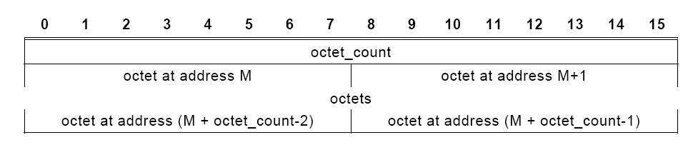

2 - 16比特字的相同内存dump的传输。 *word_count* 具有上一例 *octet_count* 一半的值 。

DumpWordType::= ARRAY [word_count UNSIGNED16] OF WORD16.

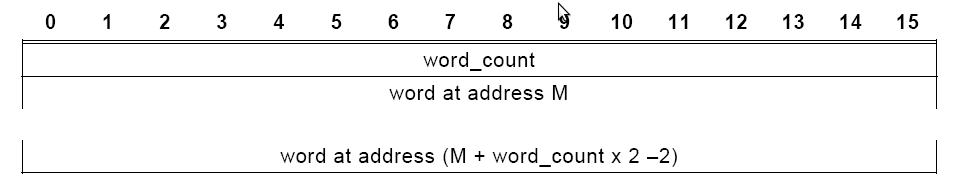

3- 由嵌套数据结构（未指定的偏移）的域给定的元素个数

DumpOctetType::= ARRAY [array_count] OF WORD8.

4 - 由嵌套数据结构的一个结构化域指定的元素个数

::

    HeaderType::= RECORD
    {
        name ARRAY [32] OF CHARACTER8
        bodysize UNSIGNED16,
        ...
    }
    FrameType::= RECORD
    {
        header HeaderType
        body ARRAY [ header.bodysize ] OF CHARACTER8
    }

5- 字符串， 其中stop字符是一个空格

::

    ProfibusString::= ARRAY [STOP = ‘20’H] OF CHARACTER8.

2.4.4.5 选择类型记号
-----------------------

2.4.4.5.1 定义
^^^^^^^^^^^^^^^^
引用一个固定的，无序的不同类型的列表的结构化类型。
每个新类型的值正好是组件类型的一种。

.. note::

   此类型与没有特定标记的ASN.1中的 **ChoiceType** 对应。

2.4.4.5.2 语法
^^^^^^^^^^^^^^^^

::

    OneOfType::= ONE_OF [identifier | identifier EnumeratedType]
            {AlternativeTypeList}

    而且

    AlternativeTypeList::= ElementType | ElementTypeList, ElementType

    且

    ElementType::= identifier [tag] Type | [tag] Type

    且

    tag::= UnsignedNumber | DefinedValue | identifier

如果一个命名的变量用于标记，这个变量将会位于嵌入元素的结构体中。

如果标记变量与选择位于同一个层次的嵌套，则变量的名称只需要包含即可。

如果变量处于另一个层次的嵌套之中，则相同级别嵌套的路径应该包含。

例如：

1 - 标记是一个数（因为数可能会定义于不同的位置，所以此种方法不推荐）

::

    Commands::= ONE_OF [choice_var ENUM8]
    {
        [3] OpenSequence,
        [2] CloseSequence,
        [5] StandbySequence
    }

2- 标记是一个在选择之前的16比特的枚举类型

::

    CommandType::= ENUM16
    {
        OPEN (3),
        CLOSE (2),
        STANDBY (5)
    }
    Commands::= ONE_OF [choice_var CommandType]
    {
        [OPEN] OpenSequence,
        [CLOSE] CloseSequence,
        [STANDBY] StandbySequence
    }

3- 标记与嵌入的结构具有相同的嵌套层次

::

    Commands::= ONE_OF [choice_var]
    {
        [OPEN] OpenSequence,
        [CLOSE] CloseSequence,
        [STANDBY] StandbySequence
    }
    Command_Frame::== RECORD
    {
        choice_var CommandType,
        ...
        command Commands;
        ...
    }

4 - 标记定义为同一嵌套级别的一个域中的子域

::

    Commands::= ONE_OF [Command_Frame.header.choice_var]
    {
        [OPEN] OpenSequence,
        [CLOSE] CloseSequence,
        [STANDBY] StandbySequence
    }
    Command_Frame::== RECORD
    {
        header RECORD
        {
            ....addresses ...
            choice_var CommandType
            ....
        }
        commands Commands
    }

.. note::

   相对路径（例如， -/-/header) 不推荐。

2.4.4.5.3 编码
^^^^^^^^^^^^^^^^
一个 **ONE_OF** 会在标记域表明的选项值之前发送并编码。

传输值的大小或者隐式地说明，或者由自身的类型来表明。

.. note::

   **ONE_OF** 是只有一个元素的 **SOME_OF**

例如:上面命令选项中的一个特定值会传输为：

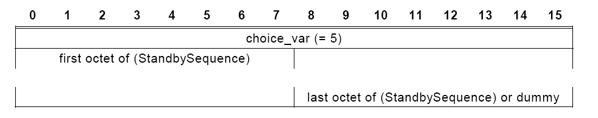

2.4.4.6 集合类型记号
-----------------------

2.4.4.6.1 定义
^^^^^^^^^^^^^^^^
引用一个固定大小的，无序的唯一类型的列表的结构化类型，其中的一些类型可能是可选的。
新类型中的每个值是一个无序的列表值，每个对应传输的组件类型。

.. note::

   此类型与具有显式标记的ASN.1的 **SetType** 类型对应。

2.4.4.2.2 语法
^^^^^^^^^^^^^^^^

::

    SetType::= SOME_OF { ElementTypeList}

    而且

    ElementTypeList::= ElementType | ElementTypeList, ElementType

    且

    ElementType::= [tag] NamedType

    且

    tag::= identifier | identifier ElementType | ElementType

如果标记是一个命名的变量，对应的变量属于同一嵌套级别的数据结构或者同一嵌套级别的域的子域，
在此种情况下，变量应该由它的完整路径来标识。

如果集合类型的变量个数固定，引用名可以对每个成员忽略，因为每个成员的目的从它们的类型来看是明显的。

如果选择是一个枚举类型，用来选择集合元素的枚举常数会置于括号中。

如果选择是一个 *bitset* 变量，则在嵌入数据结构之前变量会被定义，或者属于相同嵌套层次的域的子域，在
这种情况下，变量应该由它的全路径来标识。

例如

1 - 在集合值之前的域为无符号整形的标记

::

    MemberType::= SOME_OF [UNSIGNED8]
    {
        OPENSEQ [3] Type_OpenSequence,
        CLOSESEQ [2] Type_CloseSequence,
        STANDBY [5] Type_StandbySequence
    }

2 - 引用名忽略

::

    MemberType::= SOME_OF [UNSIGNED8]
    {
        [3] Type_OpenSequence,
        [2] Type_CloseSequence,
        [5] Type_StandbySequence
    }

3- 枚举类型作为标记（推荐用于实际）

::

    MemberType ENUM8
    {
        OPENSEQ (3),
        CLOSESEQ (2),
        STANDBY (5)
    }
    CommandsType::= SOME_OF [MemberType]
    {
      [OPENSEQ] Type_OpenSequence,
      [CLOSESEQ] Type_CloseSequence,
      [STANDBY] Type_StandbySequence
    }

4- bitset作为标记

::

    MembersType BITSET8
    {
        OPENSEQ (3),
        CLOSESEQ (2),
        STANDBY (5)
    }
    CommandsType::= SOME_OF [members]
    {
        [OPENSEQ] Type_OpenSequence,
        [CLOSESEQ] Type_CloseSequence,
        [STANDBY] Type_StandbySequence
    }
    Commands_Frame::= RECORD
    {
        members MembersType,
        commands CommandsType
    }

2.4.4.2.3 编码
^^^^^^^^^^^^^^^^

集合通过传输每个选择的值来编码。

如果一个标记被包含， 它会先于每个选择的值， 特殊标记 FFH 关闭传输集合。

如果标记被一个 bitset 来替换， bitset会在集合传输之前被传输， 
集合的不同成员会被继续传输。

例如

1- 上面的 MemberType 的一个特殊值会被传输为：

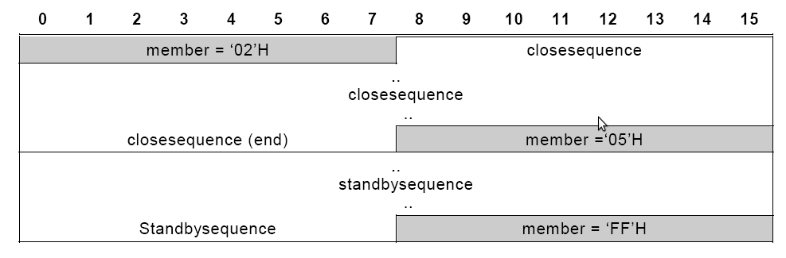

2 - 如果标记由一个bitset来替换，则编码会：

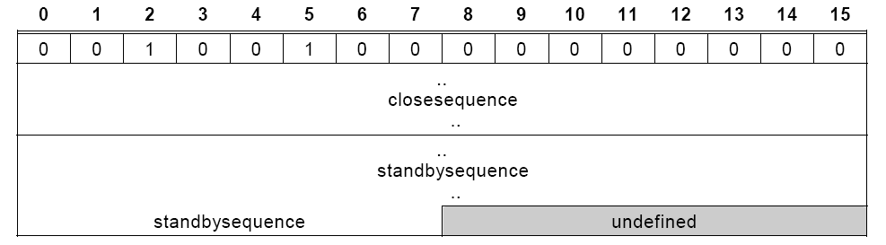

2.4.5 对齐
============

对于任意的类型， 在一个16或者32比特限制（或者任意的比特限制）的条件下，
对下一个域可能需要增加填充来对齐。

例如 下面定义了一个字符数组， 它在32比特限制下对齐， 而不管 *count* 的值。

AlignedString::= ARRAY ALIGN 32 [count] OF CHARACTER8.

2.4.6 特殊类型记号
===================

一些结构化的类型具有特殊的类型提示符(designator).

2.4.6.1 字符串类型记号
-----------------------

**STRING#** 是一个 **CHARACTER8** 的数组， 其中终结符为字符 **00H** ,
字符串的大小是从最高位字符开妈计算， 即使传输的字符串可能会更大。

例如： 一个类型为 **STRING32** 的文本字符串， 可以由 **CHARACTER8** 的数组来表示 (32 STOP='00H')

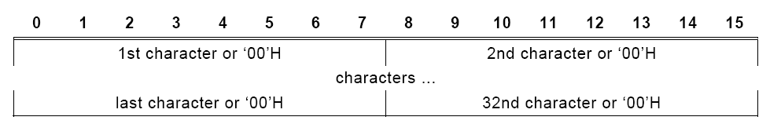

2.4.6.2 TIMEDATE48类型记号
-----------------------------

2.4.6.2.1 定义
^^^^^^^^^^^^^^^^

一个使用从UTC(Universal Coordinated Time)开始的时间到当前的秒数表示的结构化类型。（从1970年1月1日 00:00:00)

.. note::

   此类型用于实际时间的分布， 以及标记，同步。

2.4.6.2.2 语法
^^^^^^^^^^^^^^^^
::

    TimeDate48::= RECORD
    {
        seconds SIGNED32, -- elapsed since 1970, January
        1st, 00:00
        ticks UNSIGNED16 -- fraction of seconds (1 tick
        = 1/65536s)
    }

2.4.4.2.3 编码
^^^^^^^^^^^^^^^^

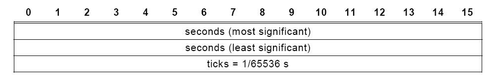

时间可以以15.3微秒的粒度来表示（=1/65536s)

范围是68年

小数部分的精度至少为10比特。

没用到的低位应该置为0.

.. note::

    A TimeDate48 variable will wrap around on year 2038, January 19, 3:14:07 UTC. This wrap-around should
    be considered in the test of the software.

2.4.6.3 TIME64类型记号
-----------------------------

2.4.6.2.1 定义
^^^^^^^^^^^^^^^^

一个使用从UTC(Universal Coordinated Time)开始的时间到当前的秒数表示的结构化类型。
（从1900年1月1日 00:00:00, 这个时间没有得到闫年的时间补偿)

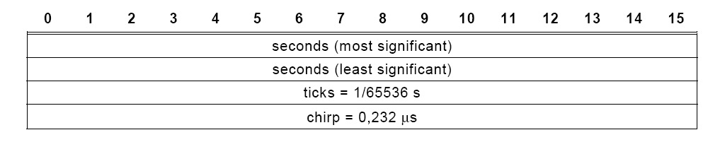

.. note::

   这个时间定义取自于 **RFC1305**, 它定义了分布时钟系统的同步协议。
   它与UNIX时间不同， UNIX时间是基于1970年。

.. note::

   A Time64 variable will wrap around in the year 2036. This wrap-around should be considered in the test of
   the software. This time definition can therefore also be considered as defining the time remaining until January
   2036.

2.4.6.4 ASN.1 boolean8类型记号
---------------------------------

2.4.6.4.1 定义
^^^^^^^^^^^^^^^^^^^^^^^^^^^^^

具有两个不同值 **TRUE** 和 **FALSE** 的原类型。

.. note::

   这是ASN.1的 **BooleanType**

2.4.6.4.2  语法
^^^^^^^^^^^^^^^^^^^^^^^^^^^^^

Boolean8Type::= BOOLEAN8

2.4.6.4.3 编码 
^^^^^^^^^^^^^^^^^^^^^^^^^^^^^

一个 *boolean8* 类型的变量会被编码为8比特, 00000000B被解释为FALSE
其它值被解释为TRUE.

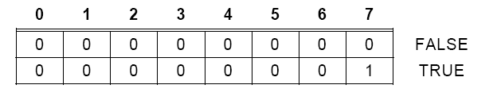

2.4.6.5 Little-Endian(低字节序)类型记号
--------------------------------------------

为了与外部设备的匹配， 下面的类型允许使用 **Little-Endian** 来进行表示数据结构。
这些类型不能用于新的项目。

::

    ENUM_L16 Little-Endian representation of a 16-bit enumeration type
    INTEGER_L16 Little-Endian representation of a 16-bit integer
    INTEGER_L32 Little-Endian representation of a 32-bit integer
    UNSIGNED_L16 Little-Endian representation of a 16-bit unsigned
    UNSIGNED_L32 Little-Endian representation of a 32-bit unsigned

.. note::

   其它类型也可以使用相同的模式来构建。
