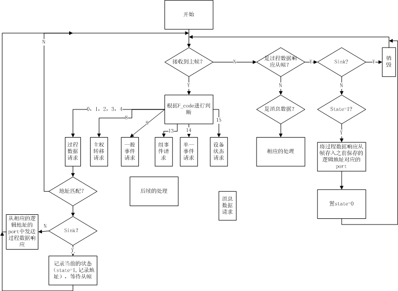
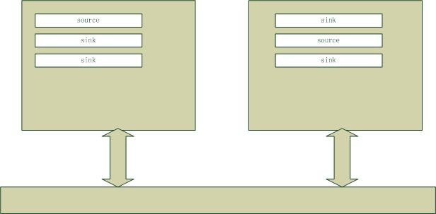

=================================
TCN从设备OPNET仿真相关文档
=================================

.. .. highlight:: c

从设备仿真逻辑
==================

从设备相关逻辑图如下：

相关说明如下：

过程变量的处理逻辑
-------------------

处理过程为：

#. 收到过程数据请求主帧
#. 与自己的地址相符（不符则直接销毁）
#. 自己的对应port的类型:

    * source: 则直接从对应的port中取出dataset进行发送
    * sink: 则记录状态(包括:置state=1, 记录逻辑地址), 等待从帧。
#. 回到等待帧状态

.. note::

    TM中有多个port，其中用于过程数据通信的port由逻辑地址来索引在,用于消息通信的使用设备地址(物理地址)来索引.

    过程数据通信本质是 **多个设备的相同逻辑地址的port的数据集进行同步** .

port结构图如下:

消息数据的处理过程
--------------------

处理过程为:

#. 收到 **一般事件请求主帧** ,如果地址相符,则生成 **事件标识响应从帧** 并发送
#. 收到 **组事件请求主帧** ,如果地址相符,则生成 **事件标识响应从帧** 并发送
#. 收到 **单一事件请求主帧** ,如果地址相符,则生成 **事件标识响应从帧** 并发送
#. 收到 **事件阅读请求主帧** ,如果地址相符,则生成 **事件阅读响应从帧** 并发送

.. note::

    此处的地址相符是指主帧中的地址与本设备的设备地址(物理地址)相同.

    这里的 **事件阅读响应从帧** 发送的是实际的数据(通常为消息数据).

设备状态的处理过程
--------------------

处理过程为:

#. 收到 **设备状态请求主帧** ,地址相符,则生成相应的 **设备状态响应从帧** 并发送.
#. 地址不相符,则销毁

.. note::

    此处的 **地址相符** 是指, **设备状态请求主帧** 中的设备地址字段与本设备的设备地址相同.

    **设备状态响应从帧** 的具体格式可参见 p259.

其它情况的从帧
-----------------

其它情况,如主权转移,监视数据等处理过程中的从帧,从设备并不关心,直接销毁.

OPNET中的相关结构体说明
=========================

port数据结构
------------

::

    typedef struct port
	{
	int type; // 0:souce, 1:sink 
	Dataset dataset; // every port has a dataset as the content of buffer
	int port_address; 	// the address of the port, also known as the logical address
	}port;

    // dataset 定义为：
    typedef struct Dataset
	{
	int type;	// indicates the type of the dataset, which will be used to generate the frame dynamically. The options: PV16, PV32, PV64, PV128, PV256
	int data;	// the data of the dataset
	}Dataset;
    
    

    

OPNET中的相关函数说明
==========================

.. note::

    本节说明在仿真中用到的重要的几个函数。其它函数可参见源代码。

void inauguration_init()
--------------------------

* 参数：无
* 返回值：无
* 描述：本函数主要是进行该设备的初运行时的一些初始化工作，包括：端口定义，设备地址等。
* 注意：目前代码中未实际完成相应的初始化工作，在实际中需要读取相应的配置数据进行初始化的工作。
* 备注：本函数会调用 *init_ports()* 函数

int is_logical_address_matched(int addr)
----------------------------------------------

* 参数：addr是主帧中的逻辑地址
* 返回值：-1表明与所有的端口都不匹配；端口索引，匹配则返回端口的数组索引
* 描述：用来判断 **过程数据请求主帧** 与该设备的端口是否匹配。
* 注意：所有端口的地址应该是 **不同** 的。
* 备注：无。

void generate_PV_and_send(int type, int data)
-----------------------------------------------

* 参数：type是要产生的 **过程数据响应从帧** 的类型（主要是长度不同），data是对应的需要产生的数据（即填充给PDR的data字段的值）
* 返回值：无
* 描述：根据PDR的类型会进行相应包的生成，并且发送
* 注意：data字段的定义
* 备注：无

void myitoa(int num, char* s, int radix)
-----------------------------------------

* 参数：num是所要转换的整数，s是目标字符串，radix是基数（即依据的进制）
* 返回值：无
* 描述：将整数转换为对应的基于特定进制的字符串，结果会存在s中
* 注意：s为函数调用者预定义的，所以要足够大，以能够承载转换得来的字符串位数
* 备注： **在TCN仿真中可能会需要在不够16bits的情形下进行比特填充**

int is_group_address_matched(int M, int C)
---------------------------------------------

* 参数：M为组地址高位差异的地址部分（为比特的长度），C为组地址相同的低位部分（为比特的值）
* 返回值：匹配返回1，否则返回0
* 描述：用于判断一个 **组事件请求主帧** 与该设备的地址是否匹配
* 注意： **注意比特填充的问题**
* 备注：无

void save_to_queue(Packet \*pkt)
-------------------------------------

* 参数：pkt是收到的包（消息数据）
* 返回值：无
* 描述：将收到的 **消息数据响应从帧** 存入 *RCV_QUEUE* 
* 注意：代码中已经完成了对队列满情况下的处理
* 备注：无

void generate_EIR_and_send(int f_code, int addr)
----------------------------------------------------

* 参数：f_code主帧中的f_code域中的值，addr是设备的地址
* 返回值：无
* 描述：对于 **一般事件请求、组事件请求、单一事件请求** 当匹配时，生成相应的 **事件标识响应从帧** 并发送
* 注意：f_code和addr用于对生成的从帧中 *Data* 域的数据填充
* 备注：无

void generate_DSR_and_send()
---------------------------------

* 参数：无
* 返回值：无
* 描述：生成相应的 **设备状态响应从帧** 并发送
* 注意：当前代码只是进行了简单的赋值，在实际中需要是 **初始化的配置** 和 **定期的扫描** 结果
* 备注：无

void process_uplayer()
---------------------------------

* 参数：无
* 返回值：无
* 描述：处理上层发来的包，并且存入到 *SEND_QUEUE* 中
* 注意：无
* 备注：无

在仿真中一些问题的总结
=========================
