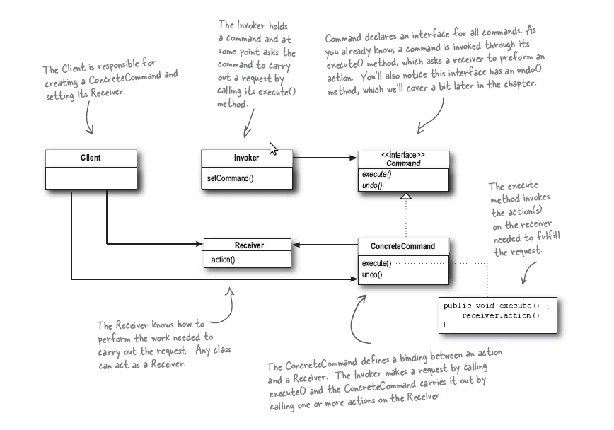

.. Author: Tower Joo<zhutao.iscas@gmail.com>
.. Time: 2009-06-08 00:40

========================================
command模式
========================================

.. index:: 
	command

.. _command:

command模式定义
========================================
**The Command Pattern** encapsulates a request as an object, thereby letting you
parameterize other objects with different requests, queue or log requests, and 
support undoable operations.

**命令模式** 将一个请求封装为一个对象, 因此使得你可以使用不同的请求来参数化其它的对象,
对请求进行排队或者对请求进行日志,并且支持撤销操作.

**当需要将请求的对象与执行请求的对象去耦合时,请使用命令模式**.

问题描述
========================================

引入 *command* 模式:

.. image:: ../../image/command_exp.png

**command** 模式的类图如下:

具体代码
========================================

下载请点击 :download:`这里 <../../code/command.cpp>`

.. literalinclude:: ../../code/command.cpp
	:language: c++
	:linenos:

输出结果为:

::

    The light is on
    The light is off
    Current Speed of fan:3
    Current Speed of fan:3  // the last action

面对新的需要
========================================

对于新的请求,只需如下操作即可:

* 继承 **Command** 类
* 实现其中的接口

更多注意
========================================

在上面的类图(及实现)中,其中最核心的 **去耦合** 部件即是 **Command** 类.

.. note::

    关于 **为请求排队**, 例如 **调度器**, **线程池**, **事件队列** 等.

    .. image:: ../../image/request_queue.png

    其中,事件队列与执行操作的对象是完全 **去耦合** 的.

参考更多
========================================

#. `Command_Pattern <http://en.wikipedia.org/wiki/Command_pattern>`_

