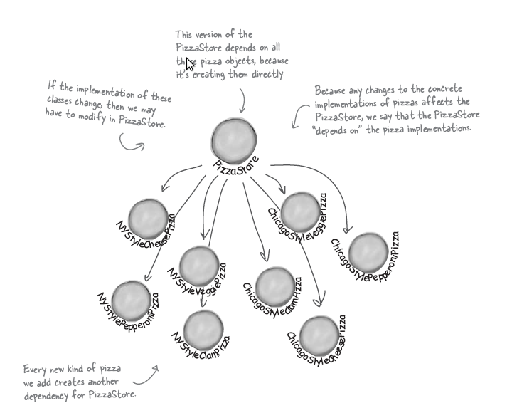
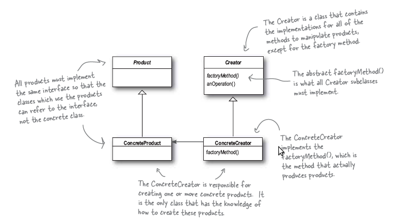
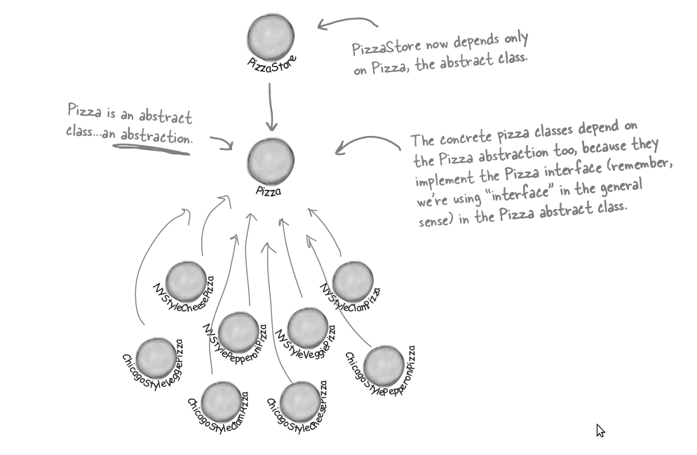
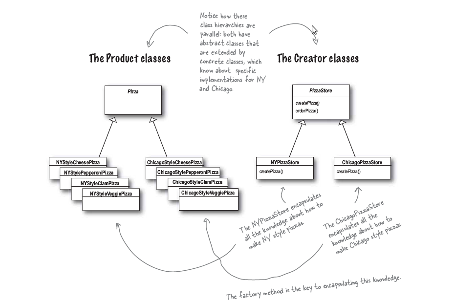

.. Author: Tower Joo<zhutao.iscas@gmail.com>
.. Time: 2009-06-05 16:10

.. _factory_method:

========================================
factory method模式
========================================

.. index:: factory method

.. _factory:

factory method模式定义
========================================

**Factory Method** define an interface for creating an object, but
let subclasses decide which class to instantiate. **Factory Method**
lets a class defer instantiation to the subclasses.

**工厂方法** 定义了用来创建对象的接口，但是让子类来决定实例化哪个类。
**工厂方法** 使得一个类将实例化的过程转移到子类。

问题描述
========================================

一个工厂生产种类的pizza，并且在不同的地点有分厂，于是具有如下的需求：

* 根据不同的pizza和地点会有不同的类型的pizza
* 可能会增加新的地点和种类的pizza

具体可见图：

基本的 **工厂方法** 如下：

使用工厂方法的如下：

具体的类图如下：

具体代码
========================================

下载请点击 :download:`这里 <../../code/factory.cpp>`

.. literalinclude:: ../../code/factory.cpp
	:language: c++
	:linenos:

输出结果为:

::

    Preparing NY Style Sauce and Cheese Pizza
    Tossing dough...
    Adding sauce...
    Adding toppings:
        Grated Reggiano Cheese
    Bake for 25 minutes at 350
    Cutting the pizza into diagonal slices
    Place the pizza in official PizzaStore box
    Ethan ordered a NY Style Sauce and Cheese Pizza

    Preparing Chicago Style Sauce and Clam Pizza
    Tossing dough...
    Adding sauce...
    Adding toppings:
        Grated Reggiano Clam
    Bake for 25 minutes at 350
    Cutting the pizza into diagonal slices
    Place the pizza in official PizzaStore box
    Joel ordered a Chicago Style Sauce and Clam Pizza

面对新的需要
========================================

需要增加新地点时，如california，可以按照如下进行：

* 继承 *Pizza* 类生成特定于california的Pizza类
* 继承 *PizzaStore* 类生成特定于california的工厂类

更多注意
========================================

需要注意的是：

* *Factory Method* 是基于类继承的，继承于一个抽象的工厂基类（注意与 :ref:`abstract_factory` 的区别）
* *Factory Method* 模式将实例化的工作将给子类

设计原则：

**Depend on abstraction. Do not depend on concrete class.**

.. note::

    关于 **Dependency Inversion Principle**, 使用下面的思路来减少依赖（实际的代码不可能完全遵守，但尽量遵守，除非有更好的理由):

    * No variable should hold a reference to a concrete class.
    * No class should derive from a concrete class.
    * No method should override an implemented method of any of its base classes.

参考更多
========================================

* `Factory_Method_Pattern <http://en.wikipedia.org/wiki/Factory_method_pattern>`_

