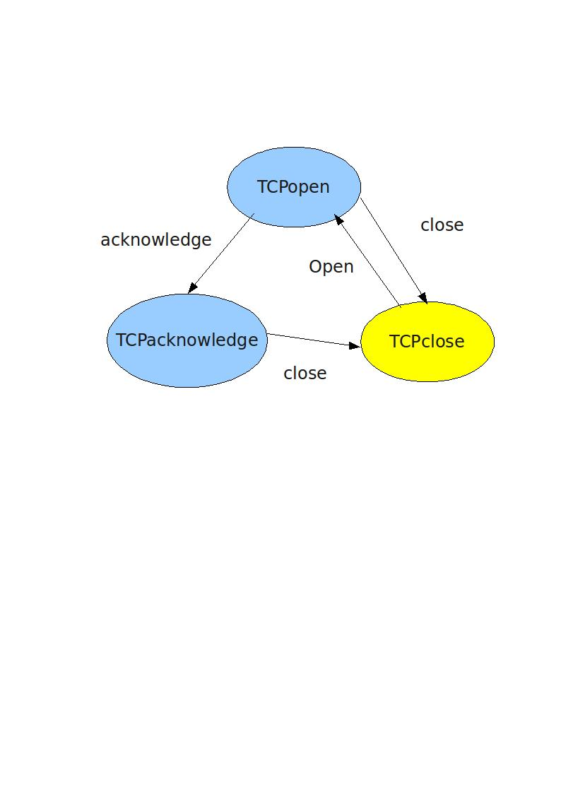

.. Author: Tower Joo<zhutao.iscas@gmail.com>
.. Time: 2009-06-11 13:59

========================================
state模式
========================================

.. index:: 
	state

.. _state: 
	

state模式定义
========================================

**The State Pattern** allows an object to alter its behavior when its internal
state changes. The object will appear to change its class.

**状态模式** 允许一个对象当其内部状态更改时来更改其行为.
对象会表现为更改自己的类.

问题描述
========================================

模拟TCP的建立过程,状态图如下:

**状态模式** 的类图如下:

.. image:: ../../image/state_class.png

具体代码
========================================

下载请点击 :download:`这里 <../../code/state.cpp>`

.. literalinclude:: ../../code/state.cpp
	:language: c++
	:linenos:

输出结果为:

::

    The Tcp is open
    The Tcp is acknowleged.
    The Tcp is closed.
    The Tcp is not opened yet.

面对新的需要
========================================

如果有新的状态加入,只需要:

* 继承State类
* 根据相应的状态图来实现相应的方法

更多注意
========================================

注意 :ref:`State模式<state>` 与 :ref:`strategy模式<strategy>` 的区别与联系:

* 二者的类图几乎完全相同
* 目的不同:
    
    * 可以把state模式看作是 **将很多种条件(情况)放在特定的上下文中**, 对于特定的 **状态图** (状态是明确的)
    * 可以把strategy模式看作是 **继承的一种可扩展(弹性)的选择**, 对于可能的 **算法** 

**状态模式** 的好处:

* 取代的繁琐的条件语句
* 易于扩展
* 耦合少(使用状态的client对于状态是解耦合的)

但是使用 **状态模式** 可能会导致大量的类.

参考更多
========================================

#. `State_Pattern <http://en.wikipedia.org/wiki/State_pattern>`_

