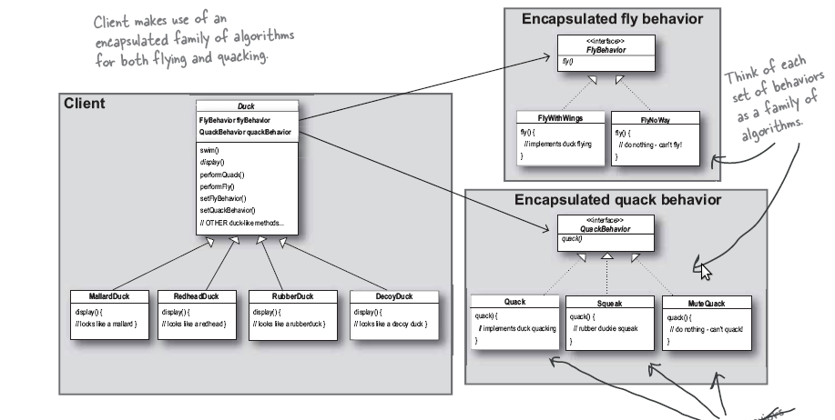

====================
strategy模式
====================

.. index::
    strategy

.. _strategy:

strategy模式定义
=================

**strategy** 定义了一类的算法,并且封装每一个算法,使得每个算法可以互换. **strategy**
使得从使用它的用户那里 **独立** 地 **变化**.

问题描述
====================

在实际的OO设计中可能会面对需求不断变化的情况,而如何能够不改变已有的代码,而去适应新的需求
这就是设计模式的意义.

场景描述:

一个游戏模拟公司的一个鸭子游戏的最初设计如下:

.. image:: ../../image/duck-uml.png

此时新的需求来了,要求为鸭子增加 **飞** 和 **叫** 两个功能.

开始我们可能会想使用继承,直接在父类增加 `void fly()` 和 `void quack()` 两个方法.

但是经过进一步思考,可能某些鸭子 **不会飞** , 如塑料鸭子, 有的鸭子也不会叫,
即使都会飞,都会叫,可能叫法和飞法也不同.

经过我们的深思熟虑,我们决定采用这样的类图:

.. image:: ../../image/strategy.png

.. note::

    使用委托( *delegate* )的方法,让一个类集来完成 **差异化** 部分,此处即为飞翔和叫.

    在这个类集中,我们对于不同的具体的飞翔和叫实现不同的方法,即 *fly* 和 *quack* 的具体实现.

    而保持主类 *Duck* 的 **纯净** (即与差异化的部分无耦合,或者很少), 这样当增加新的需求时
    无需更改主类.

具体的主类 *Duck* 的类图如下:

.. image:: ../../image/duck-strategy.png

完整的类图如下:

具体的代码
====================

下载请点击 :download:`这里 <../../code/strategy.cpp>`

.. literalinclude:: ../../code/strategy.cpp
    :language: c++
    :linenos:

输出结果为:

::

    I'm really flying
    GuaGua, I'm quacking
    I can't fly.
    I can't quack at all
    I'm really flying
    I am destroyed.
    I am destroyed.

面对新需求
==========

如果这时客户又有增加一个 **吃** 的需求时, 我们这时可以这样应对:

* 增加一个 *EatBehavior* 基类,并定义相应的各种 **吃** 的类集
* 在 *Duck* 类中增加代理成员,类似于 *flyBehavior* 和 *peformEat()* 成员方法
* 即可

补充:

虽然对主类 *Duck* 增加了相关的成员和成员函数,但是 **增加远比修改要好的多**.

更多注意
==========

设计准则
---------

#. Identify the aspects of your application that vary and *seperate* them from what stays the same 
#. Program to an interface, not an implementation
#. *Favor composition over inheritance*

**Program to an interface not to an implementation.**

如何理解这句话?

.. note::

    *Program to an implementation* 的代码会像这样:

    .. code-block:: c++

        Dog d = new Dog();
        d.bark();

        Cat c  =new Cat();
        c.mio();

    
    而 *Program to interface* 的代码会是这样:

    .. code-block:: c++

        Animal *a;
        Dog d;
        Cat c;
        a = &d;
        a->makeSound();
        a = &c;
        a->makeSound();

        // 甚至我们可以这样
        a = getAnimal();    // 运行时获得特定的动物
        a->makeSound(); 
        

